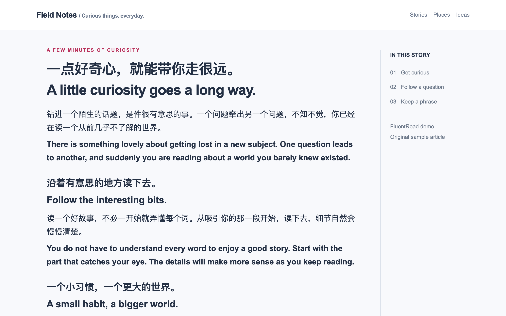

# FluentRead

### Another language? Keep reading.

Found something good to read? Don’t let the language put you off. Read it in two languages, check a tricky sentence, and keep a phrase you like.

**Open source · GPL-3.0 · DeepSeek Harness session core**

[Get the extension](#get-fluentread) · [Website](https://fluent.thinkstu.com/en/) · [Guide](https://fluent.thinkstu.com/en/guide/) · [简体中文](./misc/README_ZH.md)

## Open source. With DeepSeek Harness inside the reading card.

FluentRead is an **open-source browser extension under [GPL-3.0](./LICENSE)**. Read the code, build your own version, and bring your ideas to the project.

The reading card integrates a **browser adaptation of the DeepSeek Harness session core**. Explain a sentence, reference its paragraph, and keep asking follow-up questions using your chosen AI model. FluentRead connects the conversation to reading history, optional learning memories, and a learning center for the expressions you want to keep.

[Try the reading card →](https://fluent.thinkstu.com/en/guide/deepseek-harness)

## Read the whole thing. Or just this bit.

**A long article?** Translate it on the page and keep the original nearby. Follow along paragraph by paragraph, check a name or detail, and restore the original when you’re done.

**A sentence that won’t quite click?** Hover over a paragraph or select a passage for a quick translation. The AI reading card can explain the tone, unpack the sentence, and show how an expression is used.

**A phrase worth keeping?** Save words, phrases, and sentences to the learning center. Come back to the original context, try writing your own sentence, and revisit it later.

## Pictures, files, videos. Those too.

- **Images & selected areas:** translate text inside a picture or draw around a small area to get text you can copy.
- **Documents:** open PDF, ePub, DOCX, and other supported files; read both languages, edit translations, and download the result.
- **Video subtitles:** read bilingual subtitles on YouTube and X. Supported X videos can also use local AI transcription after a model download.

[Explore the tools and their requirements →](https://fluent.thinkstu.com/en/guide/)

## Make yourself comfortable

Set your regular sites to translate automatically, change translation styles, or move and hide menu entries. Choose the ready-to-use free translation service, connect your own provider, or use a local Ollama model.

AI explanations require a configured AI service. Third-party services may charge separately. Cloud translation sends relevant text to the chosen provider; local OCR does not make every feature offline. See [service setup](https://fluent.thinkstu.com/en/config/translation-engines) and [data & privacy](https://fluent.thinkstu.com/en/guide/privacy).

## Get FluentRead

[Chrome](https://chromewebstore.google.com/detail/djnlaiohfaaifbibleebjggkghlmcpcj) · [Edge](https://microsoftedge.microsoft.com/addons/detail/kakgmllfpjldjhcnkghpplmlbnmcoflp) · [Firefox](https://addons.mozilla.org/en-US/firefox/addon/%E6%B5%81%E7%95%85%E9%98%85%E8%AF%BB/) · [Userscript](https://greasyfork.org/en/scripts/482986)

Install, refresh an article, and open FluentRead. Keep the source on automatic detection, choose your target language, and translate the page. Enable selection translation in the menu if you’d like to check individual passages.

Browser and store versions can differ. The userscript provides core webpage tools; image capture, local models, and video features depend on the browser and extension version. [Installation guide →](https://fluent.thinkstu.com/en/guide/getting-started)

## Help, contribute, or share

[Troubleshooting](https://fluent.thinkstu.com/en/guide/faq) · [Report an issue](https://github.com/FluentRead/FluentRead/issues) · [Architecture](./docs/architecture.md) · [Testing](./docs/testing.md) · [Website rules](./docs/contributing/site-adaptation.md)

Descriptions and ready-to-upload store images live in the separate [press & store kit](./marketing/README.md).

FluentRead is open source under [GPL-3.0](./LICENSE). See [third-party notices](./public/third-party-notices/) and [maintainer references](./docs/maintainers/README.md) for attribution and implementation notes.
