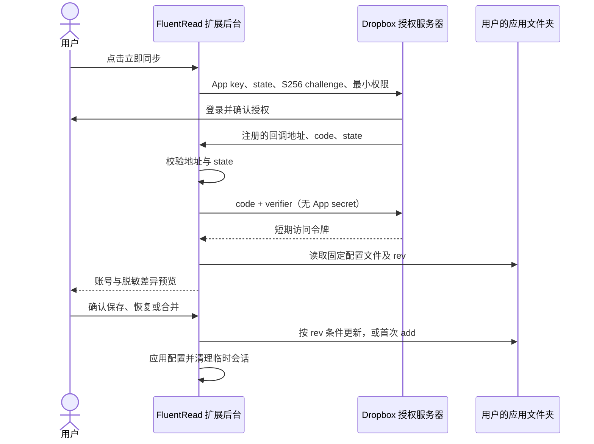
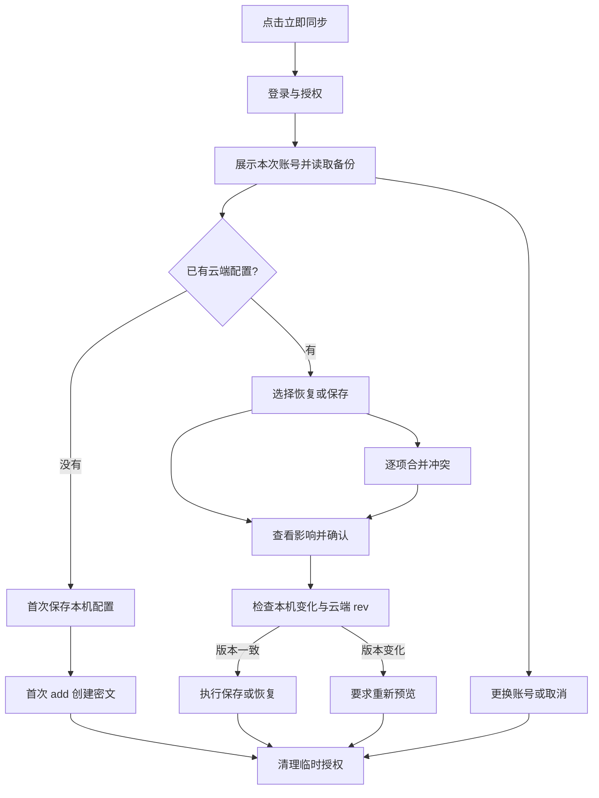

# Dropbox 配置同步：从创建应用到发布

这篇指南面向 FluentRead 维护者。你创建一次 Dropbox 应用、配置权限和回调地址，把**公开 App key** 放进扩展构建。普通用户只需在设置中点击“立即与Dropbox同步”，在 Dropbox 授权后确认保存、恢复或合并；不用创建应用、填写令牌或输入同步密码。

本文与 `src/platform/dropbox/` 实现对应。控制台示例取自官方文档并添加标注，**不是当前 FluentRead 应用的实时截图**。控制台可能更新，操作时以字段名称为准。应用尚未配置时，设置页会显示“此版本尚未启用 Dropbox 同步”，不会打开一个注定失败的登录窗口。

## 1. 背景：为什么还要 Dropbox？

Google Drive 和 Dropbox 是两种可选的配置保存位置，用户可以选择自己已有的账号。FluentRead 不搭建配置同步服务器，也不把两个平台的备份自动互相转存。账号记录、上次同步时间和比较基线分别保存在本机。

同步内容：包含API Key、OAuth Token、鉴权请求头、自定义请求体及URL中的鉴权参数，不包含单词本、聊天记录和用量统计。这里的 OAuth Token 是**用户配置的翻译服务凭据**；本次 Dropbox 同步的访问令牌不会进入配置备份。

这是用户主动触发的一次同步：授权 → 预览 → 确认 → 清理临时授权。没有持续后台轮询，也没有“断开连接”按钮。用户登错账号时，在预览中选择“更换 Dropbox 账号”，或点击“取消”后重新开始。

## 2. 原理与文件位置

扩展是公开客户端，不能安全保管 App secret。因此采用**授权码 + S256 PKCE**：每次生成随机 `state` 和一次性 `code_verifier`，校验回调，再换取短期访问令牌。不请求 refresh token，也不把 App secret 打包进扩展。参见 [Dropbox OAuth 指南](https://docs.dropboxapi.com/dropbox-api/docs/oauth)。



在 Dropbox 网页中，文件位于 **Apps / 应用名 / fluentread-config.encrypted.json**。它属于可见的应用文件夹，用户可以删除；与 Google Drive 的隐藏应用数据区不同。API 路径写成 `/fluentread-config.encrypted.json`，因为 App folder 应用看到的根目录就是自己的文件夹。参见 [Dropbox 入门文档](https://www.dropbox.com/developers/reference/getting-started)。

上传前使用现有 AES-GCM 配置加密格式；明文配置上限 **20 MiB**，云端密文上限 **32 MiB**。固定应用口令随源码公开，用户无需输入。**持有密文的人可以按公开口令解密**，它不等于由用户独占密钥的端到端加密；访问保护依赖 Dropbox 账号、应用授权和设备安全。完整备份应当像包含服务密钥的配置一样保管。

## 3. 开始前准备什么？

| 项目 | 你需要做什么 |
| --- | --- |
| Dropbox 账号 | 用维护者账号登录 [App Console](https://www.dropbox.com/developers/apps) |
| 应用 | 创建 Scoped access、App folder 应用 |
| App key | 公开应用标识，相当于 Google Client ID；可以提交公开标识，不能提交 App secret 或访问令牌 |
| 回调地址 | 从实际安装扩展的 `identity.getRedirectURL('dropbox')` 获取 |
| 网站与隐私政策 | 使用公开的 [FluentRead 首页](https://read.thinkstu.com/) 与 [隐私政策](https://read.thinkstu.com/guide/privacy) |
| 开发环境 | Node.js、pnpm，以及 FluentRead 仓库；不需要自己的同步服务器 |

## 4. 创建 Dropbox 应用

打开 [创建应用页面](https://www.dropbox.com/developers/apps/create)，登录后按下图操作。


1. **Choose an API**：选择 **Scoped access**。
2. **Choose the type of access you need**：选择 **App folder**。本功能只保存自身配置，不需要访问用户其他文件。
3. **Name your app**：填写唯一名称，例如 `FluentRead-Sync-你的后缀`。示例中的中文后缀只是占位，实际可用你的英文标识；名称被占用就换一个。
4. 接受页面上的开发者条款后，点击 **Create app**。

原始示例来自 [Microsoft Learn](https://learn.microsoft.com/en-us/microsoftsearch/dropbox-admin-setup)，示例中选中的是 Full Dropbox；上图保留原图状态并明确标出**实际要改选 App folder**。访问范围的定义以 [Dropbox 官方开发者指南](https://docs.dropboxapi.com/dropbox-api/docs/developer-resources/developer-guide) 为准。

如果已经误建为 Full Dropbox，先创建正确的 App folder 应用再接入本功能；不要沿用更大的权限范围。

## 5. Permissions：配置四项权限

进入刚创建的应用，点击 **Permissions**。勾选四项用户 API 权限，然后滚动到页底点击 **Submit** 保存。


| Scope | 本功能中的用途 |
| --- | --- |
| `account_info.read` | 读取账号标识与邮箱，展示当前账号并防止混用备份 |
| `files.metadata.read` | 配置文件元数据访问权限 |
| `files.content.read` | 下载加密备份以生成差异预览和恢复配置 |
| `files.content.write` | 首次保存和按版本更新加密备份 |

不要勾选 Team、分享、联系人或其他业务权限。四项权限仍受 **App folder** 的文件范围限制。旧官方示例图未列出 `files.metadata.read`，实际列表中也要勾选。每个接口所需 scope 见 [Dropbox API 参考](https://www.dropbox.com/developers/documentation/http/documentation)。

修改 Permissions 后，旧令牌不会自动获得新权限。保存后重新开始同步，重新完成授权。

## 6. Settings：App key 与 OAuth 回调

### 6.1 复制 App key

回到 **Settings**，找到 **App key**，复制它。**App secret 不需要给扩展使用，也不需要提供给用户或写进仓库。**

在 FluentRead 仓库中复制 `.env.example` 为 `.env`，填写：

```dotenv
WXT_DROPBOX_APP_KEY=这里填公开AppKey
```

不要填“Generated access token”。App key 只是告诉 Dropbox 哪个应用在请求权限；它不是用户令牌，也不是同步密码。

### 6.2 获取准确回调地址

Chrome 的默认官方扩展 ID 是 `djnlaiohfaaifbibleebjggkghlmcpcj`，对应回调：

```text
https://djnlaiohfaaifbibleebjggkghlmcpcj.chromiumapp.org/dropbox
```

**仍应从实际安装的扩展核对一次**。Chrome 打开 `chrome://extensions`，开启开发者模式，找到 FluentRead，点击“Service Worker / 检查视图”，在扩展后台控制台执行：

```javascript
chrome.identity.getRedirectURL('dropbox')
```

复制返回的完整地址。Edge 的商店 ID、开发版本 ID 可能不同；用 `edge://extensions` 在实际扩展后台执行同一命令。Firefox 到 `about:debugging#/runtime/this-firefox`，找到 FluentRead → 检查，在扩展控制台执行：

```javascript
browser.identity.getRedirectURL('dropbox')
```

Firefox 地址由浏览器生成，不能照抄 Chromium 的地址或凭空拼接。浏览器行为见 [Chrome identity](https://developer.chrome.com/docs/extensions/reference/api/identity) 和 [Firefox getRedirectURL](https://developer.mozilla.org/en-US/docs/Mozilla/Add-ons/WebExtensions/API/identity/getRedirectURL)。

### 6.3 注册回调并允许 PKCE


1. 在 **OAuth 2 → Redirect URIs** 的输入框中粘贴完整回调地址。
2. 点击右侧 **Add**。Chrome、Edge、Firefox分别测试时，把各自实际回调都添加进去。
3. 若看到 **Allow public clients (Implicit Grant & PKCE)**，保留 **Allow**，因为它同时控制 PKCE。若新界面将两项分开，只启用 PKCE，未使用的 implicit grant 可关闭。
4. 图中的 `localhost` 是旧官方示例，与本扩展无关。**不要填写网站首页或隐私政策 URL 作为 OAuth 回调。**
5. **Generated access token → Generate** 仅供开发者手动调试，不是正常用户登录流程，本实现无需点击它。

回调必须完全匹配，包括域名和路径；不要擅自加斜杠。参见 [Dropbox 回调与公开客户端说明](https://docs.dropboxapi.com/dropbox-api/docs/oauth)。

## 7. Branding 与测试用户

在 **Branding** 中使用与官网一致的 FluentRead 名称、说明和图标；简介写明“浏览器双语翻译与阅读辅助工具；Dropbox 仅用于用户主动备份和恢复扩展配置”。Website 使用 `https://read.thinkstu.com/`，Privacy policy 使用 `https://read.thinkstu.com/guide/privacy`。邮箱填写维护者真实支持邮箱。

应用注册的唯一名称、显示名称与应用文件夹名称可能不同，以控制台显示为准。不要宣称 Dropbox 提供翻译或 AI 生成功能。

开发状态通常先允许应用所有者使用。需要其他账号测试时，在 Settings 的 **Development users / Enable additional users** 区域允许其他开发用户连接。开发模式不等于可以无限开放；正式面向用户时，需要按 [Dropbox 生产审批流程](https://docs.dropboxapi.com/dropbox-api/docs/developer-resources/developer-guide) 操作，以当前控制台的开发用户额度和审批入口为准。

**合并代码、发布扩展、Dropbox 应用取得生产访问，是三件独立的事。** 文档和构建通过不能代替生产审批；审批通过也不能代替实际账号联调。

## 8. 构建与第一次实测

在已填写 `.env` 的 FluentRead 工作目录运行：

```bash
pnpm install
pnpm compile
pnpm build
```

Chrome 扩展管理页 → **加载已解压的扩展程序** → 选择 `.output/chrome-mv3`。修改 App key 或回调配置后，重新构建并重新加载扩展。`.env` 是构建输入，已安装的旧包不会因为你改了 `.env` 自动获得新配置。

Firefox 使用 `pnpm build:firefox`，并加载其生成的包。代码只有在浏览器提供 identity 和 session storage 时才启用 Dropbox；用户脚本和其他不支持的环境显示替代备份提示。

实测清单：

- 打开设置 → **配置管理 / 备份与恢复**。未点击同步时，不应打开授权或读取 Dropbox。
- 点击 **立即与Dropbox同步**；登录自己的测试账号并授权，检查预览中的邮箱。
- 该账号尚无备份：确认“保存到云端”，成功后查看 Apps 中的配置密文文件。
- 改动一个普通设置，再预览并选择“恢复云端配置”；第二步确认影响后恢复。
- 使用第二个临时浏览器配置或另一台设备登录同一账号，验证完整设置及服务凭据可以恢复。
- 让两端各改一处设置，选择“逐项合并”；相关服务连接设置作为整组选择，私密内容不直接展示。
- 预览中点 **更换 Dropbox 账号**，在重新登录页面选择其他账号；旧账号文件和上次成功同步记录不应被取消操作覆盖。
- 预览中点 **取消**、关闭页面或等待超过十分钟，应能重新开始；本机配置不应被取消操作修改。
- 预览后从其他设备更新云端文件，本次确认应提示重新预览，不覆盖新的版本。

自动化测试使用虚构账号和令牌，不代表真实 Dropbox 账号已验证。真实联调完成前，不应在发布说明中写“已对所有账号验证可用”。

## 9. 同步产品流程


下方 Mermaid 描述完整分支，便于维护和在 GitHub 中查看。



下载会替换本机配置及凭据，上传会替换该账号的云端配置；合并才按项保留两端修改。操作前显示影响，确认前不写配置。同步后只保留账号标识、邮箱、成功时间和加密比较基线；短期 Dropbox 令牌仅在扩展会话存储中暂存，完成、失败或取消后删除。

清理本地缓存不等于撤销网站登录或 Dropbox 对应用的授权。如果想撤销，可到 [Dropbox 已连接应用设置](https://www.dropbox.com/account/connected_apps) 移除应用；删除备份则在自己的 Apps 文件夹删除 `fluentread-config.encrypted.json`。两者相互独立。

## 10. 常见问题

| 提示或现象 | 处理方式 |
| --- | --- |
| 此版本尚未启用 | 维护者检查公开 App key，重新构建和加载扩展；普通用户等待启用版本 |
| redirect_uri 不匹配 | 在实际扩展后台生成回调，完整复制到 Settings → Redirect URIs → Add |
| 无法交换授权码 | 检查公开客户端 / PKCE 是否允许；不要往扩展里加入 App secret |
| 授权范围不完整 | Permissions 勾选四项并 Submit，重新开始授权 |
| 其他账号无法连接 | 检查开发用户设置、开发额度或生产审批状态 |
| 账号不是预期账号 | 预览中点“更换 Dropbox 账号”，重新登录；清理临时令牌不会退出网站登录 |
| 授权过期 / 401 | 重新开始同步，不会在确认时偷偷打开第二个登录窗口 |
| 云端配置已变化 / 409 | 重新预览；代码使用 rev 条件更新，不盲目重试覆盖 |
| 文件无法解密 | 检查是否移入了普通 JSON 或损坏文件；本机配置未应用，先保留原文件排查 |
| 文件过大 | 明文配置最多 20 MiB，密文最多 32 MiB；减少大请求体或使用完整数据备份 |
| 用户脚本看不到可用按钮 | 此功能需要浏览器扩展身份接口与会话存储；使用完整数据备份 |

维护者交付顺序：**创建应用 → 权限与回调 → App key 构建 → 两个测试账号与两个设备实测 → 生产访问与商店发布**。App secret、访问令牌、个人测试邮箱和真实配置都不进入示例或测试截图。
