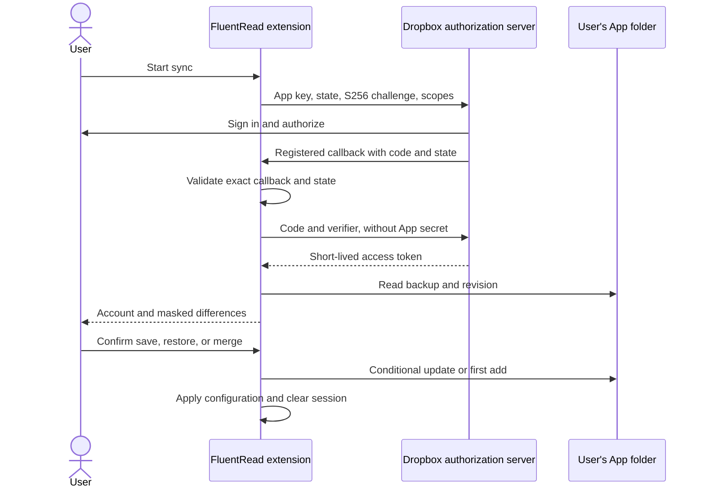
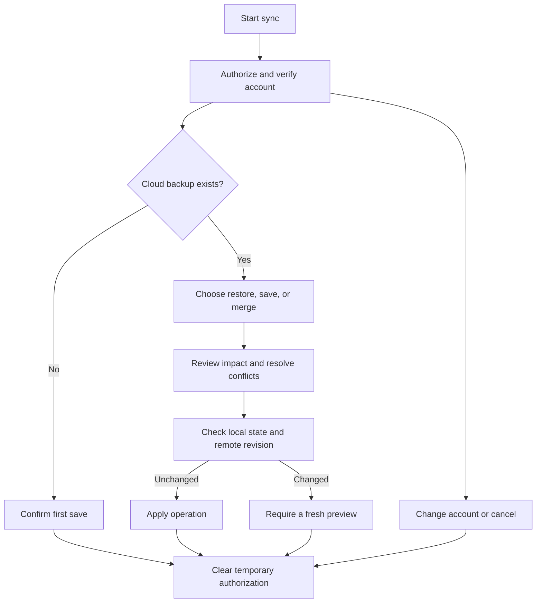

# Dropbox configuration sync: setup and release

This guide is for FluentRead maintainers. Register one Dropbox application, configure its permissions and redirect URLs, and include its **public App key** in the extension build. End users select Dropbox under **Settings → Backup & restore → Cloud configuration backup**, authorize their own account, and confirm save, restore, or merge. They do not create applications, paste tokens, or enter an encryption password.

Console screenshots in the [illustrated Chinese guide](/config/dropbox-sync) are annotated documentation examples, not live screenshots of FluentRead's Dropbox application. Field names are more reliable than an older screenshot when the console changes. Builds without an App key clearly show that Dropbox sync is not enabled.

## 1. Background and data scope

Google Drive, Dropbox, and WebDAV are optional places to store your own configuration. FluentRead does not run a configuration sync server or automatically copy backups between providers. Each provider has separate account records, last successful sync time, and comparison baseline.

Configuration sync includes API keys, OAuth tokens configured for translation services, authentication headers, custom request bodies, and authentication parameters in URLs. It excludes wordbooks, chat history, and usage statistics. The temporary token used for the current Dropbox operation is never included in the backup.

Sync is an explicit operation: authorize, preview, confirm, then clear the temporary session. There is no background polling or persistent connection to disconnect. Use **Change Dropbox account** in the preview if the wrong account is selected, or cancel and start again.

## 2. How authorization and storage work

An extension is a public OAuth client and cannot keep an App secret confidential. The implementation uses an **authorization code with S256 PKCE**: a random state binds the callback to the request; a one-time verifier binds token exchange to the extension that started authorization. No App secret or refresh token is included. See the [Dropbox OAuth guide](https://docs.dropboxapi.com/dropbox-api/docs/oauth).



The visible Dropbox file is **Apps / application name / fluentread-config.encrypted.json**. The API path is `/fluentread-config.encrypted.json` because an App folder application sees its own folder as its root. It cannot read unrelated Dropbox files. See [Dropbox getting started](https://www.dropbox.com/developers/reference/getting-started).

The existing AES-GCM format encrypts configuration locally before upload. Limits are **20 MiB for plain configuration** and **32 MiB for the encrypted file**. The fixed application passphrase is public in the source; someone who obtains the encrypted file can decrypt it using that passphrase. Account permissions and device security provide the main access protection. This is not encryption with a key known only to the user.

## 3. Create the application

Sign in to the [Dropbox App Console](https://www.dropbox.com/developers/apps), then open [Create app](https://www.dropbox.com/developers/apps/create).

1. Under **Choose an API**, select **Scoped access**.
2. Under **Choose the type of access you need**, select **App folder**.
3. Enter an available unique application name, such as `FluentRead-Sync-your-suffix`.
4. Accept the developer terms and click **Create app**.

If you created a Full Dropbox application by mistake, create an App folder application for this feature instead. The [annotated creation screenshot](/config/dropbox-sync#_4-创建-dropbox-应用) specifically points to App folder even though the original documentation example selected Full Dropbox. Access boundaries are defined in the [Dropbox developer guide](https://docs.dropboxapi.com/dropbox-api/docs/developer-resources/developer-guide).

## 4. Configure Permissions

Open **Permissions**, enable these four user API scopes, then scroll down and click **Submit**:

| Scope | Purpose |
| --- | --- |
| `account_info.read` | Verify account identity and display its email |
| `files.metadata.read` | Access backup file metadata |
| `files.content.read` | Read the encrypted backup for preview and restore |
| `files.content.write` | Create a backup or update it conditionally |

Do not enable team, sharing, or unrelated permissions. These scopes are still constrained by App folder access. An older screenshot may omit `files.metadata.read`; enable it in the actual console. See the [API reference](https://www.dropbox.com/developers/documentation/http/documentation).

Changing Permissions does not add scopes to an existing token. Save the change and start authorization again.

## 5. App key and exact redirect URLs

### Public App key

Open **Settings** and copy **App key**, not App secret or Generated access token. In the FluentRead repository, copy `.env.example` to `.env` and set:

```dotenv
WXT_DROPBOX_APP_KEY=yourPublicAppKey
```

An App key identifies the application. It is neither a user access token nor an encryption password. Do not put an App secret or a generated token in the extension or repository.

### Browser-generated callback

The default official Chrome extension ID is `djnlaiohfaaifbibleebjggkghlmcpcj`, giving:

```text
https://djnlaiohfaaifbibleebjggkghlmcpcj.chromiumapp.org/dropbox
```

Verify the callback from the **actual installed extension**. In `chrome://extensions`, enable developer mode and open FluentRead's service worker inspector. Run:

```javascript
chrome.identity.getRedirectURL('dropbox')
```

For Edge, use `edge://extensions` and run the same command in its actual extension inspector. Store IDs and local development IDs can differ. In Firefox, open `about:debugging#/runtime/this-firefox`, inspect FluentRead, and run:

```javascript
browser.identity.getRedirectURL('dropbox')
```

Copy the whole result. Do not invent a Firefox callback from its extension URL. See [Chrome identity](https://developer.chrome.com/docs/extensions/reference/api/identity) and [Firefox getRedirectURL](https://developer.mozilla.org/en-US/docs/Mozilla/Add-ons/WebExtensions/API/identity/getRedirectURL).

### Register callbacks and allow PKCE

1. In Dropbox **Settings → OAuth 2 → Redirect URIs**, paste the complete callback into the input and click **Add**.
2. Add each actual browser callback used for testing or release.
3. If the control is **Allow public clients (Implicit Grant & PKCE)**, keep **Allow**, since it also controls PKCE. If the controls are separate, enable PKCE; the unused implicit grant is unnecessary.
4. Do not enter your website homepage or privacy URL as an OAuth redirect. Do not add a slash that the browser did not return.
5. **Generated access token → Generate** is for manual developer debugging. This implementation does not require it.

Callbacks must match exactly, including host and path. The [illustrated Settings example](/config/dropbox-sync#_6-3-注册回调并允许-pkce) marks the input and Add button; the old example's localhost URL does not belong to this extension.

## 6. Branding, development users, and production access

Use FluentRead's name, description, and icon consistently. Describe it as a browser bilingual translation and reading assistant, with Dropbox used only for user-initiated configuration backup and restore. Use `https://read.thinkstu.com/` as the website and `https://read.thinkstu.com/en/guide/privacy` as the privacy policy. Provide the maintainer's actual support email.

Application registration, displayed branding, and App folder names may differ; check the console. Dropbox is not the translation or AI provider.

Development access initially allows the application's owner to connect. For other test accounts, inspect **Development users / Enable additional users** in Settings. Development mode does not provide unlimited public access. Follow the current console's limits and the [production approval instructions](https://docs.dropboxapi.com/dropbox-api/docs/developer-resources/developer-guide) before a public release.

Merging code, publishing the extension, and obtaining Dropbox production access are separate steps. Build checks do not establish approval or prove live authorization works.

## 7. Build and test

With `.env` configured, run:

```bash
pnpm install
pnpm compile
pnpm build
```

Load `.output/chrome-mv3` using **Load unpacked** in Chrome's extension manager. Rebuild and reload when the App key changes; editing `.env` does not update an already installed package. Firefox uses `pnpm build:firefox`. Dropbox requires browser identity and session storage APIs; unsupported environments can use local backup files.

Test these paths with real test accounts before release:

- Opening settings causes no Dropbox authorization or network request.
- A first backup requires confirmation before the encrypted file is created.
- Saving a changed setting, then restoring the cloud backup, replaces settings and credentials as described in the preview.
- Another device can restore complete configuration and service credentials.
- Independent changes can be merged, with conflicting service connection settings selected as groups and private values masked.
- Changing accounts and canceling keeps the last successful account record and leaves both backups untouched.
- Canceling, leaving the page, or expiration after ten minutes clears the temporary session.
- A remote change after preview rejects stale confirmation instead of overwriting another device's update.

Automated tests use fictional accounts and tokens. They are not proof of a real Dropbox account connection or production approval.

## 8. Confirmation and deletion

The screenshot below shows the real extension interface with a fictional account and synthetic Dropbox responses. It does not represent live OAuth verification.




Restore replaces this device's configuration and credentials. Save replaces the selected account's cloud configuration. Merge preserves selected changes from both sides. Successful sync retains only the account ID, email, time, and encrypted comparison baseline; the temporary Dropbox token is removed when the operation finishes, fails, or is canceled.

Clearing a local session does not sign out of the Dropbox website or revoke the application's access. Revoke access in [Dropbox connected apps](https://www.dropbox.com/account/connected_apps). Delete the backup separately in the Apps folder. Revoking access or uninstalling the extension does not delete an existing cloud backup or settings already restored on another device.

## 9. Troubleshooting

| Symptom | Action |
| --- | --- |
| Sync not enabled in this build | Maintainer supplies a public App key and rebuilds; users need an enabled version |
| Redirect mismatch | Generate the actual browser callback and register it exactly using Add |
| Code exchange fails | Check public client / PKCE settings; do not add an App secret |
| Incomplete permissions | Enable all four scopes, Submit, and authorize again |
| Another account cannot connect | Check development users, limits, or production approval |
| Wrong account | Use Change Dropbox account; clearing the token does not sign out of the website |
| Authorization expired / 401 | Start sync again; confirmation does not open a second login silently |
| Cloud changed / 409 | Generate a fresh preview; writes use the revision instead of blind retries |
| Cannot decrypt backup | Preserve the file for diagnosis; ordinary JSON or a damaged file is not applied |
| File too large | Reduce large custom bodies or use a local backup; limits are 20 MiB plain and 32 MiB encrypted |

Release sequence: **create application → permissions and callbacks → App key build → live account and device tests → production access and store release**.
