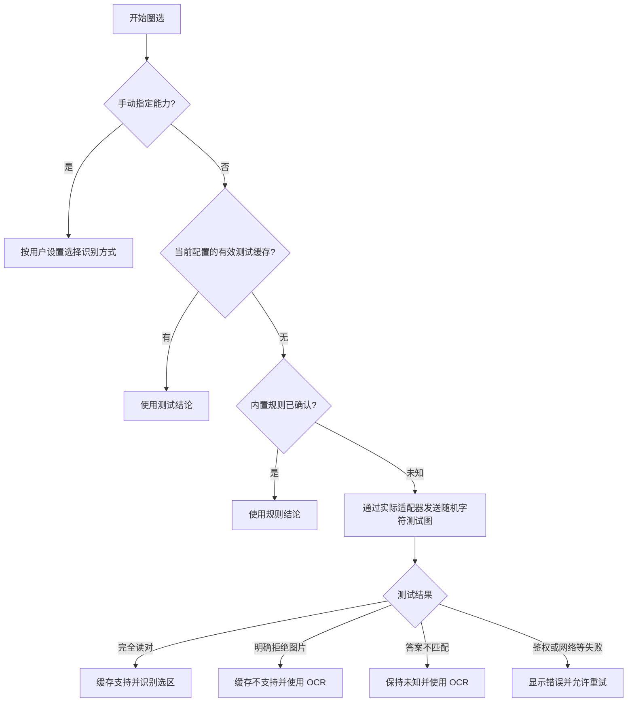

# 圈选翻译

圈选翻译识别所选屏幕区域中的文字，适用于截图、图表、暂停的视频画面和漫画。识别结果与译文显示在卡片中，支持复制。

功能开启时，网页只监听圈选快捷键和右键命令；首次有效触发后才创建圈选界面。界面使用封闭的 Shadow DOM，停用插件或关闭圈选功能时会移除。

## 开始圈选

1. 在 **图片翻译 → 圈选翻译** 设置中确认功能开启，选择识别方式和翻译服务。
2. 在网页按一次圈选快捷键（默认 **Shift+Z**），拖动框住想读的区域。
3. 松开鼠标，等待识别与翻译。
4. 拖动卡片顶部，把结果移到方便阅读的位置；可以复制译文、展开原文或查看选区截图。

使用本地 OCR 时需要相应语言包。缺少语言包时，点击 **下载语言包并重试**，即可下载并继续翻译当前截图，无需重新圈选。下载失败后可再次尝试；按 Esc 取消当前任务。

按 **Esc** 退出。想换地方点 **重新圈选**；修改服务后点 **重新翻译**，可复用当前截图。截图完成后，滚动页面或调整窗口会保留结果卡片，方便边看原页面边核对；截图尚未完成时页面位置变化会取消旧选区，避免识别错误区域。切换到其他标签页仍会关闭结果并释放截图。选区模式本身不受页面自动滚动影响。

## 换一个快捷键

在 **图片翻译 → 圈选翻译** 设置的 **圈选快捷键** 中选择预设组合键，或选择 **自定义快捷键** 录制自己的组合键。单个字母键需要搭配 Ctrl、Alt/Option 或 Shift；已被悬浮、全文、划词、输入框翻译或快捷翻译方案占用的组合键会给出提示。未完成录制时仍会使用默认的 Shift+Z。

快捷键在网页输入框、文本域和可编辑区域中不会触发，避免打断打字。

## 选择文字识别方式

默认选择**优先使用模型识图**。也可以选择**本地 OCR**，图片留在本机识别，只把识别出的文字交给翻译服务。

**优先使用模型识图** 会在当前圈选服务的模型支持图片输入时，直接把裁剪后的选区图片交给模型识别。这条路径不需要 OCR 语言包；模型不支持识图时，使用本地 OCR。未知模型会先自动测试，答案不匹配、仍未确认能力时使用 OCR，并显示原因；可在翻译服务设置中按实际模型指定“支持识图”或“仅文本”。

模型能力按“手动设置 → 有效探测缓存 → 内置规则 → 未知模型测试”的顺序判断。未知模型首次圈选时，会先发送一张本地生成、仅包含随机字符的小 PNG，要求模型读出字符；答案完全匹配才确认识图能力。HTTP 200 或文字连接检查通过不等于支持识图。

也可以在 **翻译服务 → 模型偏好 → 模型识图能力** 中点击 **检测识图能力**。测试使用当前服务、地址、模型、API 格式和密钥配置，复用实际图片请求路径；不发送网页截图。测试可能产生模型调用费用，支持取消。主动测试不会改写你的手动能力选择。

探测缓存只保存在本机，有效期为 7 天，绑定服务、模型、端点、协议和凭据配置摘要。修改配置后旧缓存不会用于新配置；不保存图片、测试答案、密钥或错误正文，不进入配置历史、导出或云同步。只有接口明确拒绝图片输入才保存“不支持”。答案不匹配保持未确认，可以重试或手动指定；网络、密钥、配额或响应错误直接提示，不会悄悄改用 OCR。

DeepSeek 的 `deepseek-flash` 及仍可调用的旧别名 `deepseek-v4-flash`、`deepseek-v4-flash-vision-exp` 支持自动识图判断，Chat Completions 和 Responses 两种 API 格式都可以发送选区图片。`deepseek-v4-pro` 按官方仅文本能力处理。能力依据见 [DeepSeek 图像理解](https://api-docs.deepseek.com/zh-cn/guides/vision/)与[模型能力表](https://api-docs.deepseek.com/zh-cn/quick_start/pricing/)。

圈选使用的是**圈选翻译 → 翻译服务**中选定的服务；留空时跟随网页默认服务。翻译服务页面的“正在配置”只表示正在编辑该服务的参数，不会自动切换默认服务。结果卡片显示“免费翻译服务”时，该次任务使用本地 OCR；要使用 DeepSeek 识图，请把圈选服务设为 DeepSeek，或将网页默认服务切换为 DeepSeek 并让圈选跟随。

开启优先模型识图后，点击 **编辑识图提示词** 可以调整文字识别要求，例如保留表格列、公式、段落或特殊符号；默认提示词会要求模型只转录可见文字，不翻译、不解释、不猜测缺失内容。也可以恢复默认。提示词只用于图片文字识别，网页翻译提示词仍独立保存。模糊和手写内容仍可能识别错误，请展开选区原图核对。

## 选择译文处理方式

**标准翻译**直接翻译识别出的文字，适合清晰、排版简单的内容。

**AI 文本增强**会结合选区的全部识别文字整理断行并翻译，需要支持通用提示词的 AI 服务。这个后续步骤只处理识别文字，无法补回识别阶段漏掉的字；可以与任一种识别方式搭配。

圈选服务默认跟随网页翻译，也可以独立选择。文字识别语言包与图片翻译共用，准备方法见[图片翻译](/guide/image-translation)。

## 使用范围与数据

目前圈选截图在 Chrome / Edge 扩展中可用。浏览器内部页、受限制的视频画面、无法读取的区域可能不能截图。其他浏览器或脚本版本会按实际能力提示。

本地 OCR 不上传截图。开启优先模型识图且模型支持时，只上传裁剪后的选区图片，不上传整屏截图；随后把识别文字交给同一服务翻译。图片识别请求不进入翻译缓存，临时截图在关闭圈选后释放。结果卡片会标明本次实际使用的识别方式、翻译服务和模型。

想在整张图片上保留排版，可以改用[图片翻译](/guide/image-translation)，该功能继续使用本地 OCR 定位文字。

图片识别使用专门的识图提示词和图片请求格式，不套用服务中的自定义请求体；后续文字翻译仍按该服务的设置执行。

## 接下来

- [返回完整文档](/docs/)
- [遇到问题](/guide/faq)
