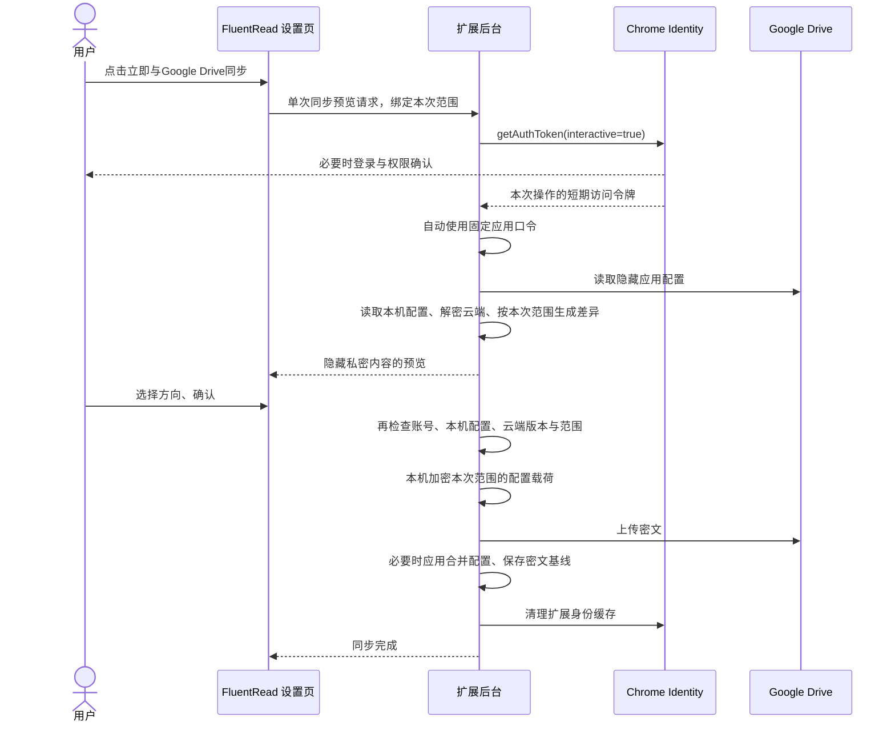
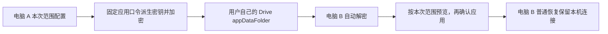
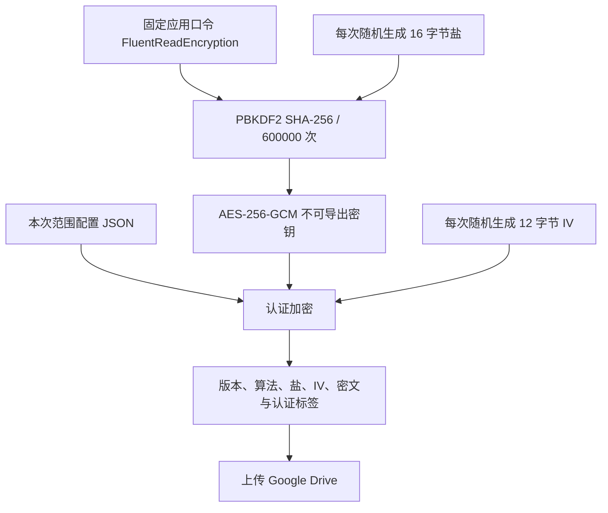
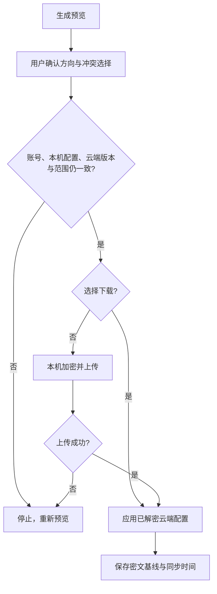

# FluentRead Google Drive 配置同步教程

这篇文档面向 FluentRead 开发者，从配置同步的背景开始，解释授权、云端文件、本机加密和冲突处理，再说明 Google Cloud 的实际操作与验证步骤。

FluentRead 直接把配置保存到**每位用户自己的 Google Drive**。开发者提供公开的应用身份，每位用户单独授权；这条路线不需要部署 FluentRead 配置服务器。本文以 PR [303](https://github.com/FluentRead/FluentRead/pull/303) 为起点，并同步说明默认普通设置与单次敏感信息同意的规则；是否已发布应以合并和商店版本为准。核对日期：2026 年 10 月 4 日。

## 1 为什么需要配置同步

电脑 A 上保存的目标语言、翻译服务、API Key、提示词、译文样式和站点规则，都属于 A 的扩展配置。电脑 B 安装扩展后拥有自己的存储，无法自动读取 A 的设置。

完整数据备份可以完成一次迁移。配置同步则让两台设备反复交换修改：A 上传，B 下载；B 修改后再上传，A 再取回。设备可能离线，也可能同时修改，因此需要共同基线与明确的覆盖确认。

| 路线 | 存储位置 | 本次实现 |
| --- | --- | --- |
| 完整数据备份 | 用户下载的本地文件 | 现有功能，适合配置和单词本等数据迁移 |
| 浏览器 `storage.sync` | 浏览器账号的同步服务 | 与 Drive 是不同机制，本次没有新增 |
| Google Drive | 用户自己的隐藏应用数据区 | Chrome 中主动触发、先预览后确认 |
| WebDAV 等其他云端 | 用户指定的服务器 | 可以沿用同步领域规则，授权与存储端口需单独实现 |

陪读蛙同样把配置文件同步与冲突选择作为产品流程，可参考[官方配置备份说明](https://www.readfrog.app/en/docs/config-backup)。FluentRead 使用自己的 Vue/WXT 配置架构；默认只同步普通设置，完整凭据快照仅在本次明确同意后参与保存或合并。

### 默认范围与单次同意

普通备份只保留已知普通设置，如语言、外观、快捷键与网站规则。`CONNECTION_FIELDS` 整组排除，包括密钥、服务凭据、鉴权信息、翻译服务选择、模型、服务地址与自定义请求参数；`PRIVATE_FIELDS`、未知根字段及嵌套含排除内容的设置组也不上传。恢复或合并普通设置保留本机完整连接、私密设置和未知字段，不能以空值或默认连接替代这些内容。

用户主动打开“本次包含 API Key 等敏感信息”，阅读公开口令与第三方账号风险、勾选确认后，才允许本次保存或合并包含全部敏感连接及私密提示词。恢复仅应用云端实际包含的内容；云端为普通备份时，即使本次同意，也保留本机敏感连接。Google 授权与这项同意分开处理。

同意默认关闭且只用于此次操作。完成、失败（包括 `prepare` 失败）、取消、离开或重开设置、切换供应商或 Google 账号后均重置。预览与事务绑定本次范围；缺少范围或范围变化时停止确认并要求重新预览。升级前的旧待确认事务失效，不能按旧完整范围继续执行。

### 内部配置格式兼容

以下版本指解密后的配置载荷；外层加密封装仍为 `fluentread-drive-encrypted` v1，不改变公开应用口令。

| 内部载荷 | 当前扩展 | 旧扩展 |
| --- | --- | --- |
| `format: fluentread-complete-config`、`version: 1`，完整敏感快照 | 仍能读取旧文件；普通模式投影后应用并保留本机连接，本次同意后才应用完整敏感内容 | 继续按原 v1 读取 |
| `format: fluentread-complete-config`、`version: 2`、`scope: settings`，普通设置快照 | 验证并只应用普通设置，保留本机敏感连接 | 安全拒绝，需升级；不得称为可被旧扩展读取 |

本次同意后的新完整敏感备份继续写原 v1，避免破坏旧扩展的完整备份兼容。普通模式写 v2，而不是缺少凭据的 v1，也不写入空密钥占位符。读取旧完整文件或恢复普通设置不会删除云端敏感信息；只有确认保存或合并普通设置后，才更新当前云端文件。关闭开关不删除旧文件或服务商保留的历史版本。

## 2 各种 ID 和凭据分别做什么

| 对象 | 用途 | 是否可以公开 |
| --- | --- | --- |
| Google Cloud 项目 | 管理启用的 API、OAuth 应用与配额 | 项目标识可以公开 |
| OAuth Client ID | 告诉 Google 是哪个应用请求授权 | 可以，随扩展发布 |
| Chrome 扩展 ID | 把 Chrome 客户端绑定到实际扩展 | 可以 |
| 扩展公开公钥 | 保持本地构建与商店的扩展 ID 一致 | 可以；不能替代商店发布权限 |
| 测试用户 | Testing 阶段允许授权的 Google 账号 | 只在 Cloud 控制台填写，无需写进代码 |
| Google 同步访问令牌 | 证明本次 Drive 请求已获授权 | 不公开，不放进同步配置，交给 Chrome 管理 |
| 配置中的服务 API Key、OAuth Token | 连接翻译服务和用户自定义接口 | 包含在加密配置内，不以明文上传 |
| 固定应用口令 | 后台使用 `FluentReadEncryption`，用户无需输入 | 随开源代码公开，不能作为保密凭据 |

因此，Client ID 可以理解为应用的公开登记编号。知道它不等于能够访问某个用户的云盘，还必须获得该用户的授权和有效访问令牌。[Chrome Identity 官方文档](https://developer.chrome.com/docs/extensions/reference/api/identity)

## 3 从用户点击到云端保存



打开设置页只读取本机同步记录，不获取令牌或访问 Google。每次点击“立即与Google Drive同步”后才为本次操作取得授权，必要时显示登录与权限窗口，再生成预览；确认预览后才会上传或应用配置。完成、失败、取消预览或离开设置后自动清理扩展身份缓存，不显示持续连接状态或“断开连接”按钮。保留密文基线与上次同步时间，便于下次同步。若配置已经同步成功、随后身份缓存清理失败，会单独显示清理待重试提示，重新打开设置时重试；该提示不表示配置同步失败。401 时只刷新一次，账号变化则停止本次操作。[Chrome Identity](https://developer.chrome.com/docs/extensions/reference/api/identity)

设置页显示“本次同步内容”、默认普通范围、敏感开关和本机连接保留说明。开启敏感范围前展示风险弹窗并要求勾选同意；预览再次显示范围，旧完整文件额外说明敏感信息不会因关闭开关而删除。上次同步账号与时间放在“立即与Google Drive同步”按钮右侧，分两行展示，时间使用次要文字颜色；窄屏时移到按钮下方，长邮箱可换行。尚无同步记录时不显示空白账号或时间。右上角显示浅灰色盾牌图标与“隐私保护”，避免在标签中承诺绝对安全。

Google 授权页面使用它自己的语言设置；若左下角显示 English (United States)，可在该下拉框中选择简体中文。当前版本只申请一项 `drive.appdata` 权限，不再同时申请邮箱身份权限。按 Google 的规则，只有一项非登录权限时不使用逐项勾选页面，用户直接确认或拒绝这项授权；扩展不会替用户点击 Google 的授权控件。实际页面仍由 Google 决定；旧版本或已有授权若显示复选框，应允许配置数据访问再点击 Continue（继续）。没有取得 Drive 权限时，同步停止且不会上传配置。[Google 分项权限说明](https://developers.google.com/identity/protocols/oauth2/resources/granular-permissions)

账号识别改用 Drive 的 `about.get`，只读取 `user(permissionId,emailAddress)`。该接口支持 `drive.appdata`，无需再申请 `userinfo.email`。账号切换保护以 Drive 的 `permissionId` 为依据，邮箱仅用于预览展示；Google 未返回邮箱时仍可同步。[Drive about.get](https://developers.google.com/workspace/drive/api/reference/rest/v3/about/get)、[Drive User](https://developers.google.com/workspace/drive/api/reference/rest/v3/User)

升级前的 OAuth 账号 ID 与新的 Drive 账号 ID 不混用。已有云端文件保留，升级后的第一次同步可能需要重新确认方向，以免按同邮箱误用旧共同基线；确认成功后保存新的密文基线。

## 4 配置存在用户自己的云盘哪里

使用 Drive 的 `appDataFolder`，这是按应用隔离的隐藏数据区。FluentRead 申请 `drive.appdata`，无需申请读取用户全部文件的 `drive` 权限。隐藏文件不显示在普通“我的云端硬盘”列表里，不能当成普通文档分享。[Google 应用数据说明](https://developers.google.com/workspace/drive/api/guides/appdata)

本次文件名为 `fluentread-config.encrypted.json`。同步状态中保存的共同基线也是密文；Google 同步令牌和同步口令不进入基线。



配置中的术语和站点规则可以随配置同步；单词本、聊天记录和用量统计不在本次配置快照范围内，需要使用完整数据备份迁移。

## 5 为什么还要本机加密

Drive 的应用隔离控制“哪个应用能访问文件”。本机加密让上传文件不包含明文配置；本次采用固定公开口令，文件保密主要依赖 Google 账号和应用授权。请保护账号、设备与文件，不能表述为绝对安全。

固定口令事实来自 `src/platform/google-drive/constants.ts` 的 `GOOGLE_DRIVE_APPLICATION_PASSPHRASE`。如果第三方账号被盗、共享目录被他人访问或备份泄露，文件中的 API Key 等敏感信息存在泄露风险。风险弹窗必须告知这些情形；建议仅同步普通设置，迁移密钥时保护账号与目录权限，避免分享备份。

按本方案的免输入要求，后台自动使用固定应用口令 `FluentReadEncryption`。用户连接 Google 账号后直接预览和确认，无需设置或记忆同步口令。这个值会随扩展及开源代码发布；任何拿到密文的人都可以据此解密。它不能提供独立于 Google 账号权限的保密保障，也不能称为用户独占密钥或秘密。



PBKDF2 用于派生密钥；AES-GCM 的认证标签可检测不匹配的密钥和未正确认证的损坏数据。随机盐与 IV 使相同配置重复上传也产生不同密文。固定口令已经公开，增加迭代次数不能恢复其秘密性；持有文件的人也能够解密后修改并重新生成有效密文。派生与加密使用浏览器的 [Web Crypto](https://developer.mozilla.org/en-US/docs/Web/API/SubtleCrypto/deriveKey)，PBKDF2-SHA256 迭代参数参考 [OWASP](https://cheatsheetseries.owasp.org/cheatsheets/Password_Storage_Cheat_Sheet.html)。

云端只保存版本化加密封装，例如：

```json
{
  "format": "fluentread-drive-encrypted",
  "version": 1,
  "kdf": "PBKDF2-SHA256",
  "iterations": 600000,
  "cipher": "AES-256-GCM",
  "salt": "随机盐的 Base64",
  "iv": "随机 IV 的 Base64",
  "ciphertext": "密文与认证标签的 Base64"
}
```

内部明文默认为经过范围过滤的普通设置 v2；只有本次明确同意才写完整敏感 v1，其中包含 API Key、配置中的 OAuth Token、鉴权请求头、服务与模型、地址、自定义请求参数及私密提示词。预览不会展示敏感值。没有明文降级路线，无法解密或损坏的文件会停止同步，不修改本机配置。

设置页没有口令输入框，固定应用口令只由后台使用，不在配置快照中另行保存。其他设备连接同一个 Google 账号即可恢复。若文件使用不同口令或已损坏，请先确保某台设备仍持有完整配置，再用扩展内的删除入口或 Drive 应用管理清理旧备份并创建新快照。修改固定应用口令会影响旧文件兼容，必须先设计迁移流程。

## 6 Google Cloud 控制台怎样操作

以下菜单对应你截图里的新界面。旧文档中的“OAuth 同意屏幕”现在通常进入 **Google Auth Platform**，左侧分为品牌塑造、目标对象、客户端和数据访问。

### 6.1 创建或选择项目

打开 [Google Cloud 控制台](https://console.cloud.google.com/)，点击顶部项目选择器，创建或选择 FluentRead 项目。显示名称与项目 ID 不一定相同；扩展同步代码不需要填写这个项目 ID。

### 6.2 启用 Google Drive API

进入 **API 和服务 → 库**，搜索 **Google Drive API** 并启用。详情页显示“已启用”或“停用 API”按钮，即表示已经完成这一步。

### 6.3 配置 OAuth 应用资料

从截图左侧点击 **OAuth 权限请求页面**；也可以在控制台顶部搜索 **Google Auth Platform**。


首次进入点击开始设置，按界面填写应用名称、用户支持邮箱和开发者联系邮箱。个人公开应用通常选择 **外部 / External**；仅组织内部应用才选择内部。

之后在左侧 **品牌塑造 / Branding** 中维护主页、隐私政策等应用资料。公开发布前必须使用真实可访问的页面，并满足控制台要求。

### 6.4 已获授权的网域应该填什么

这里只登记你实际控制、用于应用资料或相关 OAuth 配置的网域。不要填写 `github.com`：拥有 GitHub 仓库不等于拥有整个 GitHub 域名。

Chrome 原生扩展客户端主要绑定扩展 ID，这一栏不是填写扩展 ID 或 Drive 域名的地方。尚未填写主页等地址时，可删除错误添加的网域行；上线前准备自己的域名与隐私页面，并按 Google 要求验证所有权。[Google 品牌验证说明](https://developers.google.com/identity/protocols/oauth2/production-readiness/brand-verification)

### 6.5 配置数据访问范围

进入 **Google Auth Platform → 数据访问 / Data Access**，点击 **添加或移除范围**。

你截图的右侧“更新所选范围”面板已经是正确位置。列表没有显示 Drive 时，直接滚到下面 **手动添加范围**，只粘贴以下一行完整地址：

```text
https://www.googleapis.com/auth/drive.appdata
```


点击 **添加到列表**，再点击侧栏底部的 **更新 / Update**，回到数据访问主页面点击 **保存 / Save**。不要只把文字粘进输入框就离开。

`drive.appdata` 用来管理 FluentRead 自己的隐藏配置，也支持读取本次同步所用的 Drive 账号标识。不要额外添加 `userinfo.email`、`openid`、`profile`、BigQuery、Cloud Platform 或读取全部 Drive 文件的范围。若此前按旧指南添加了邮箱范围，可从所选范围中移除；运行时和新构建的 manifest 都只请求 `drive.appdata`。

### 6.6 添加测试用户

进入 **目标对象 / Audience**，应用保持 Testing 时，在 **测试用户 / Test users** 添加你要用于联调的账号并保存。测试邮箱只在这里填写，不能写入 `.env.example`、测试夹具、代码或 PR 描述。

这意味着客户端创建弹窗中的“只有测试用户拥有访问权限”是开发阶段限制，不是创建失败。公开发布需要完成目标对象的发布设置及 Google 实际要求的验证。

### 6.7 创建 Chrome 扩展客户端

进入 **客户端 / Clients → 创建客户端**：

1. 应用类型选择 **Chrome 扩展程序 / Chrome Extension**。
2. 名称填写可识别的名称，例如 `FluentRead Chrome`。
3. 内容 ID / Item ID 填写 `djnlaiohfaaifbibleebjggkghlmcpcj`。
4. 按控制台提示完成应用所有权验证，然后创建。
5. 复制生成的 **客户端 ID**。

当前公开客户端 ID：

```text
474699705334-7fua4hnkq1nmfu92cof0kdnmqsk5kth8.apps.googleusercontent.com
```

Chrome 扩展原生路线不需要把 Client Secret 放进扩展，也不需要在此客户端填写普通网站的重定向 URI。创建完成后，客户端仍可从左侧客户端列表再次查看。

## 7 怎样接入并加载开发构建

本次 PR 已连接默认公开 Client ID 和商店公开公钥。公钥从已发布 CRX 的签名信息取得，并核对其 SHA-256 派生的扩展 ID；它只稳定身份，不授予账号访问权。

如需自己的独立开发客户端，复制 `.env.example` 为 `.env.local`，设置公开标识：

```dotenv
WXT_GOOGLE_CLIENT_ID=你的开发客户端.apps.googleusercontent.com
WXT_EXTENSION_KEY=与开发扩展ID对应的公开公钥
```

没有覆盖变量时使用默认商店身份；任何情况下都不要把测试账号、Google 登录密码、访问令牌、服务 API Key 或同步口令写入这些变量。

在 FluentRead 工作树中安装依赖并生成构建：

```bash
pnpm install --frozen-lockfile
pnpm exec wxt prepare
pnpm compile
pnpm build
```

打开独立测试 Chrome 的 `chrome://extensions`，开启开发者模式，选择“加载已解压的扩展程序”，加载 `.output/chrome-mv3`。核对页面显示的扩展 ID 与客户端的内容 ID 相同。不要在仍保存唯一完整配置的日常浏览器中卸载扩展来切换测试包。

manifest 由 WXT 回调在加载环境变量后生成，包含 `identity` 权限与唯一的 `oauth2.scopes`：`drive.appdata`。Firefox/Edge 专用构建不会声明这个 Chrome OAuth 客户端；Chrome 包在 Edge 中也会显示支持范围提示。

## 8 用户怎样完成第一次同步

电脑 A：

1. 打开 FluentRead 设置 → **备份与恢复 → 备份与导入**。
2. 在 Google Drive 配置同步卡片点击 **立即与Google Drive同步**，首次使用时完成 Google 的授权。
3. 授权后自动打开同步预览，确认“本次同步账号”正确，无需输入口令；选错账号时点击 **更换 Google 账号**。
4. 云端为空时，预览只显示首次保存说明，检查同步范围。
5. 点击 **保存到云端**，等待同步完成；入口卡片显示上次成功同步的账号和时间。

电脑 B：

1. 点击 **立即与Google Drive同步**，连接同一个 Google 账号，无需输入口令。
2. 在自动打开的预览中选择 **恢复云端配置**，点击 **继续**。
3. 在“确认变更”页核对云端到本机的方向和替换说明，需要时展开差异；确认无误后点击 **恢复到本机**，替换本机配置与凭据。
4. 打开翻译服务页检查已恢复的连接信息，再验证你自己的实际服务请求。

首次同步已经有云端文件时，扩展不会自行选择覆盖方向。**保存本机配置**和**恢复云端配置**均替换完整快照；**逐项合并**则按差异合并。合并预览优先显示待确认项，提供“全部使用本机”和“全部使用云端”；已有共同基线时，可以展开查看并调整自动选择。没有差异时只需 **完成同步**，不会重写云端文件。

**更换 Google 账号**会先取消当前预览，通过 Chrome Identity 清除扩展的令牌缓存和账号偏好，再为新的预览发起交互授权。**取消**只结束这次操作；两者都不会退出浏览器中的 Google 登录或删除备份。账号选择界面由 Chrome 和 Google 控制，需在真实 Chrome 中验证自己的账号环境。入口的“上次同步账号”是本机保存的成功记录，不表示持续连接；取消、授权失败或更换账号但尚未完成同步时，保留原来的成功记录。打开设置页不会为显示该记录而发起授权。

## 9 后续修改与冲突怎样处理

同步后保存的密文共同基线 B，用来比较本机 L 和云端 R。待确认的本机快照以口令密文暂存在本机；云端快照保留原密文，共同基线复用已有密文，避免重复封装放大体积。允许 Chrome 后台休眠后重新读取；取消或完成时删除待确认数据：

| 比较结果 | 默认处理 |
| --- | --- |
| L 与 R 相同 | 不产生差异 |
| 只有本机相对 B 修改 | 推荐本机 |
| 只有云端相对 B 修改 | 推荐云端 |
| 两端相对 B 修改，且结果不同 | 用户选择本机或云端 |
| 没有可信 B | 必须明确选择方向或处理每项差异 |

普通模式不参与翻译连接组的差异与合并，并保留本机整组连接。敏感模式下，翻译服务选择、对应的连接定义、相关路由模型、API Key、请求头和请求体作为整组选择。这样不会自动把一个设备的密钥拼到另一设备的新端点。数组也作为整体处理。普通设置一致但云端仍含敏感信息时，范围变化仍需允许用户确认保存或合并普通设置，以更新当前云端文件。



预览归属于发起它的设置页面，其他页面不能替换、取消或确认它；另一页面发起同步时会提示先完成或取消原预览。预览只能确认一次，10 分钟后失效。确认时先验证完整结果及服务引用，再重新读取云端，检测修改后要求重新预览；更新必须有强 ETag 并携带 `If-Match`，412 表示版本冲突。缺少强版本时可恢复或完成无变化同步，不能无条件覆盖已有备份。上传后会回读核对文件身份和密文；两台设备同时首次创建时，仅尝试条件撤回本次新建且未变化的文件，保留其他设备的文件。

v3 元数据响应头缺少强 ETag 时，补取同一文件的 [v2 File 元数据](https://developers.google.com/workspace/drive/api/reference/rest/v2/files)中的 `etag`。只有文件 ID 与 `version` 同时匹配刚读取的 v3 版本，才允许把这个标识用于条件更新；否则重新预览。来自 v2 的 ETag 用于 [v2 files.update](https://developers.google.com/workspace/drive/api/reference/rest/v2/files/update) 的条件 `PUT`，不混用到 v3 `PATCH`。权限仍为 `drive.appdata`，无需增加读取全部云盘的范围。

若兼容元数据也没有强 ETag，预览会展示差异并明确提示仅可恢复，直接进入确认页，不显示保存、合并和多余的操作选择步骤。服务端同样拒绝伪造的保存请求，不能通过界面外的调用绕过；没有变化时仍可完成同步记录。

**并发边界：**条件更新及冲突拒绝经过协议夹具验证，尚未证明真实 Google 账号在多设备并发下的行为。已有文件不允许退回无条件覆盖；两台设备同时首次创建仍可能产生同名文件，检测后会停止，不猜测该覆盖哪一个。预检查不等于跨设备事务锁。

## 10 失败、结束授权与删除

| 情况 | 用户操作与结果 |
| --- | --- |
| 文件无法解密或已损坏 | 不写入本机，从持有完整配置的设备重新建立快照 |
| 本机或云端在预览后改变 | 重新预览 |
| 网络失败、403 或配额限制 | 保留原基线，检查网络、范围与测试用户后重试 |
| 账号切换 | 停止确认，重新核对账号与预览 |
| 下载保存失败 | 尝试恢复原配置；恢复也失败时明确提示检查本机存储 |
| 完成、失败或取消同步 | 自动清除扩展身份缓存；保留本机配置、密文基线与云端文件 |
| 撤销 Google 许可 | 在 Google 账号的第三方连接中移除 FluentRead |
| 删除云端备份 | 扩展内核对账号并确认删除；后台绑定页面、账号与版本并条件 DELETE，成功后清除本机同步基线与时间，保留本机配置 |
| 无安全版本或需手动清理 | Google Drive 网页 → 设置 → 管理应用 → FluentRead → 删除隐藏应用数据 |

清理扩展缓存与在 Google 账号中撤销许可是两个动作。单次操作结束后不主动调用 Google 的许可撤销接口。删除云端文件不会删除已下载到其他设备的配置。[Chrome 缓存清理](https://developer.chrome.com/docs/extensions/reference/api/identity)、[Google 应用数据管理](https://developers.google.com/workspace/drive/api/guides/appdata)

删除事务不解密配置，也不复用同步同意；旧 v1、普通 v2、未知格式或损坏密文可以清理。确认前重读版本，DELETE 带强 ETag 的 `If-Match`；ETag 来自 v2 时在同版本 API 上删除。文件已不存在时幂等完成；重新创建的文件需重新确认。MV3 重启可恢复删除确认，其他页面不能夺取，失败不会重放确认或清除原基线。成功删除后授权清理失败只提示缓存待清理。本次没有定时自动同步或固定口令迁移；服务商历史副本和其他设备副本需另行管理。

## 11 维护代码在哪里

| 模块 | 职责 |
| --- | --- |
| `src/platform/google-drive/constants.ts` | 公开身份、权限、文件标识与大小限制 |
| `src/platform/google-drive/auth.ts` | Chrome 原生授权、固定账号会话、401 刷新 |
| `src/platform/google-drive/api.ts` | appDataFolder 查询、下载、加密上传与响应限制 |
| `src/platform/google-drive/encryption.ts` | 口令派生、随机盐/IV、认证加密与格式验证 |
| `src/core/config/driveSync.ts` | 普通范围投影、v1/v2 载荷验证、连接保护、隐藏内容的差异与三方合并 |
| `src/services/config/googleDriveSync.ts` | 预览、确认、密文基线、失败处理 |
| `src/app/background/googleDriveSyncRuntime.ts` | 权威凭据快照、现有配置保存端口与修改队列 |
| `src/app/background/handlers/googleDriveSync.ts` | 仅允许设置页操作的可信消息协议 |
| `src/features/settings/ui/GoogleDriveSync.vue` | 账号、免口令预览、方向和冲突确认界面 |

同步通过现有 `prepareHydratedConfigForExport` 等待权威本机配置与完整凭据读取，以便可靠地保留本机连接、校验预览或构造敏感快照。普通模式随后投影成仅普通设置的载荷，不上传完整凭据。敏感模式不能使用不含凭据的公开配置、历史快照或内容脚本配置代替完整上传源；读取失败必须停止，不能把默认空凭据当作用户删除。

## 12 怎样验证并对外发布

本地检查包括真实 Web Crypto 往返、错误口令和篡改检测、完整凭据恢复/删除、三方冲突、过期预览、账号切换、网络失败、可信发送者与实际构建页面。测试使用虚构账号和凭据，不引用真实测试用户。

新增范围检查覆盖默认备份排除连接与私密信息、普通恢复或合并保留本机连接、旧完整 v1 可读、新普通 v2 被旧扩展拒绝、敏感完整 v1 兼容、旧待确认事务失效，以及单次同意重置。七语言风险弹窗、390px 与深色的浏览器专项命令见[测试与回归](../testing.md#配置云备份范围与单次敏感信息同意)。这些检查仍使用隔离浏览器和虚构凭据。

受控 HTTP 或身份夹具可以验证本地流程，不能证明 Google 真实授权、Drive 配额、商店安装或多设备并发成功。公开发布前还要完成真实测试账号授权、两台独立 Chrome 设备同步和实际服务连接，并记录明文没有出现在云端文件中。

Google Auth Platform 的 Production 与 Chrome Web Store 发布是两个独立步骤。完成 OAuth 所需品牌资料与验证，再发布包含同步功能的扩展包；仅创建 Client ID 不会让旧商店版本自动获得新按钮。Edge、Firefox 若要支持同类同步，需要设计与其网页登录流程匹配的客户端，本次提供清楚的支持范围提示。[Edge 官方 API 支持列表](https://learn.microsoft.com/en-us/microsoft-edge/extensions/developer-guide/api-support)

### 大小限制

配置 JSON 最多 **20 MiB**，云端加密文件最多 **32 MiB**。本机预览暂存独立预留 1 MiB 元数据空间，云端文件和基线不重复封装；能上传的配置可再次预览、合并和跨设备恢复。超出限制时停止操作，不覆盖本机或已有云端配置，可使用完整数据备份。

## 与 WebDAV 共用的配置云备份

设置页入口统一为“配置云备份”，Google Drive 与 WebDAV 只是存储方式。共用事务在 `src/services/config/remoteConfigSync.ts`，共用界面在 `RemoteConfigSync.vue`；各供应商保留独立连接、状态和网络适配器。WebDAV 使用本机连接密码鉴权，不使用 Google OAuth，其连接参数不进入配置导出。用户操作见[WebDAV 云备份指南](../guide/webdav.md)。
