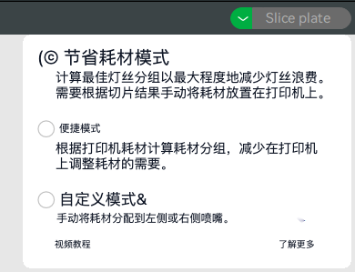
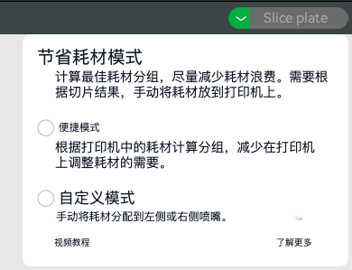

# 普通图片段落翻译与回填修复

2026-10-05。用户提供的 [Bambu 原图](https://wiki.bambulab.com/h2/manual/deal-nozzles-filament-grouping/image-5.png) 含两段三行说明。真实 Tesseract 稀疏识别将每行当成独立块，原流程逐行请求翻译，再将译文居中绘制到单行框中，导致句子上下文断开、末行独立放大和文本错位。链接下划线落在 OCR 框外，还会在背景修补时扩散成绿色色块。

## 实现

- 普通图片按源行字号、行距与对齐合段，保留标题、段间留白、列表项、同一行控件和不同栏；合并矩形内有其他文字时不跨过它。Tesseract 和单图 PaddleOCR 共用普通段落策略，漫画保留既有气泡策略。
- 合并区保留完整原文、逐行擦除框、典型源行高度和对齐方式。翻译请求及原文对照按段落映射；回填使用整段范围、常规字重和源行字号上限，留白不随段落总高扩大。
- 硬连字符保留，明确软连字符在换行连接时去除。背景擦除仅处理源行框及有界边缘，至少两像素以覆盖短链接下划线，不擦除整段矩形中的行间图案。
- 中英文使用指南同步更新。新增 `--paragraph-image <Bambu 原图路径>` 作为原图专用浏览器回归分支，可与 `--live-translation` 配合；测试夹具保留真实 OCR 的错误以区分分组修复和识别质量。

## 验证

相关 11 个测试文件共 202 项通过，覆盖普通图片两种引擎、漫画、OCR、分组、绘制、修补、原文阅读和图片生命周期。`paragraphs.ts`、`rendering.ts`、`inpainting.ts`、`offscreenRuntime.ts` 的 statements、branches、functions、lines 均为 100%。类型检查、Chrome/Firefox 构建、文档构建和测试分类审计通过；源文件头与模块边界检查共 806 项通过。

`verificationOwnership.test.ts` 两项失败，在独立导出的基础提交 `fd4fac88` 中复现同样的三个未登记脚本及十九个既有覆盖边界缺口；新增段落模块已登记，不扩大失败范围。

隔离 Edge 使用自动临时 profile，在第二屏正常尺寸窗口后台运行：`launchMode=macos-background-cdp`、`focusPolicy=launchservices-no-foreground`、`windowPlacement.mode=background-visible-no-focus`、`browserFrontmost=false`。浏览器关闭后临时 profile 删除。原图测试分别使用确定性 Google transport 和真实 Google 免费服务，真实 OCR 产出八个段落/标签，其中两段正文均由三行合成；原文对照完整，原图/译图计数 `[1,0,1]`，再次显示缓存无额外请求，无页面或控制台错误。相关完整图片流程的二十个浏览器用例通过，包括取消、重试、动态换图、offscreen 断线恢复、透明图、裁切几何与卸载。

证据目录：`/private/tmp/fluentread-image-paragraph-browser-final`（确定性排版）、`/private/tmp/fluentread-image-paragraph-live`（在线翻译）、`/private/tmp/fluentread-image-paragraph-flow`（图片生命周期）。覆盖率、构建和基线日志使用同名任务前缀保存在 `/private/tmp/`。

真实 Google 服务效果：

确定性译文只用于单独核对排版与背景修补：

仍有识别与服务边界：原图中图标被识别为 `(©`、`&`，`Learn` 被识别为 `Lear`；Google 对 filament 的术语选择也不完全一致。此次修复保证该样本整段送译与有界回填，不保证所有 OCR、复杂背景或服务译文准确。Firefox 仅构建验证，单图 PaddleOCR 分组通过算法及运行时测试，未在真实模型上复测该截图。未使用参考仓库实现，也未改版本或发布扩展。
