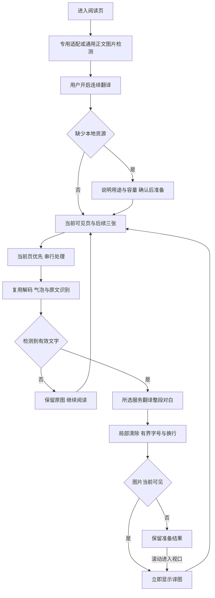
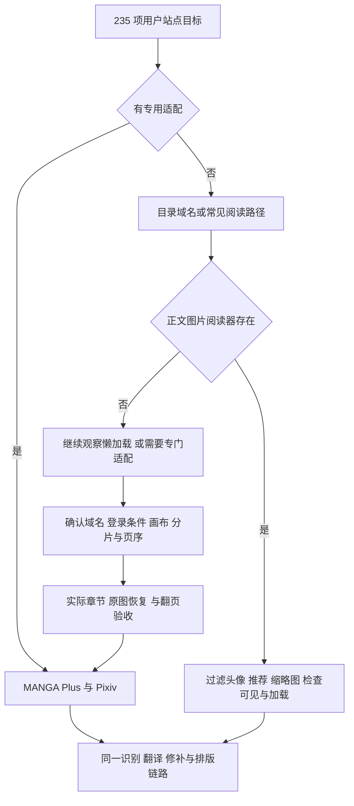
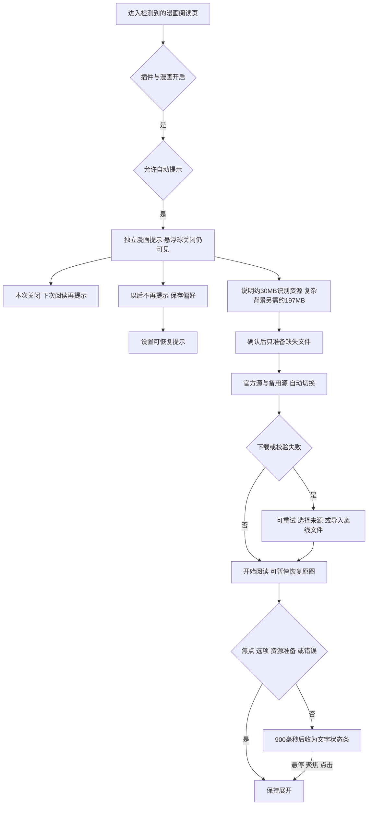

# 漫画提前翻译、性能与站点兼容性报告

后续界面修正见[漫画安静阅读与告警修复](./manga-quiet-reading-20261004)：已取消本报告中描述的自动阅读面板，翻译选项改由设置调整。

本轮在漫画阅读体验分支上增加默认提前三张、Pixiv 专用适配及通用图片阅读器检测。用户给出的全部站点都纳入[完整需求清单](./manga-sites-20261003)，重复名称去重后共 235 项。**这份清单是兼容性目标，不是 235 个站点均已验收通过的声明。** 已完成真实章节验收的站点为 MANGA Plus 与 Pixiv；画布、分片、需要登录的阅读器和未确认域名仍有后续工作。

用户引用的会员与每月 100 张属于参考产品说明。FluentRead 本轮没有新增会员或图片张数限制，仍遵循所选文字翻译服务自身的费用、请求和额度限制。站点范围来自[用户指定 Issue](https://github.com/immersive-translate/immersive-translate/issues/1809)及其贴出的列表，公开名称链接另参考[原产品使用文档](https://immersivetranslate.com/docs/features/manga/)。没有复制其私有适配代码或站点请求协议。

## 提前翻译与性能

| 行为 | 最终实现 |
| --- | --- |
| 提前多少 | 默认后续 3 张图片，可在统一设置和阅读面板选择 0–5 张；旧配置迁移为 3，0 只处理可见页 |
| 处理优先级 | 当前可见页优先，其后才启动后续图片；识别/修补仍串行，避免多个大模型竞争内存 |
| 页序 | 使用当前阅读器 DOM 中的图片顺序，取最后一张可见图片之后的 N 张；按图片计数，不按漫画印刷页计数 |
| 当前页显示 | 当前页完成即显示，不等待后续三张全部完成 |
| 图片加载 | 只处理网站已经加载并可解码的图片，不强制加载整章、不跨章预取；未加载图片仍等待网站加载 |
| 滚动 | 同一图片的在途任务继续执行；排队任务重排。图片移除、换源、换章、暂停或离开时取消旧所有权 |
| 标签页隐藏 | 允许当前在途任务完成，暂停启动新页面任务；返回后继续 |
| 有界保留 | 当前视口和最多 5 张后续图片，另允许 1 张仍在处理的旧窗口图片；位图缓存仍有数量/像素上限 |
| 预备结果 | 视口之外保留原图可见，译图进入视口才显示；不能用“全部原图已透明”来判定预翻译完成 |
| 没有识别到文字 | 保留原图，跳过文字服务、清除和空译图；继续后续页。“未检测到”不保证图片实际没有文字 |
| 解码复用 | 漫画 OCR 使用调用方已经解码的图片，减少同图二次 fetch、Blob 和 Bitmap；不关闭调用方图片资源 |

首次推理仍有初始化和修补成本。提前处理把等待移动到阅读期间，**并没有让模型每次推理都变成毫秒级**。背景准备会增加本地 CPU、内存以及可能尚未阅读页面的服务请求；希望减少处理量的用户可选择 0。快速翻页、网站还没加载下一张、缓存释放或服务连接延迟都可能继续产生等待。

## 实页测量

使用同一 macOS 设备上的生产 Chrome MV3 扩展，通过第二屏独立 Edge 临时配置运行，本地 PaddleOCR / LaMa 和真实 Google 文字翻译。四个模型文件预先导入并验证 SHA-256，处理期间阻断官方和备用来源，实际模型下载请求均为 0。时间不包含首次模型下载；这是一台设备的样本，不是跨地区或跨设备保证。

| 样本 | 当前页显示 | 整个准备窗口完成 | 已准备下一页随滚动显示 | 处理次数 |
| --- | ---: | ---: | ---: | ---: |
| [MANGA Plus 1024050](https://mangaplus.shueisha.co.jp/viewer/1024050) | 10.691 秒 | 38.434 秒 | 89 毫秒，已翻译页 | 当前页与后三页共 4 次 |
| [Pixiv 150354216](https://www.pixiv.net/artworks/150354216#1) | 24.011 秒 | 43.879 秒 | 61 毫秒，该页未检测到文字，保留原图 | 展开阅读器三页共 3 次 |

Pixiv 的 61 毫秒不是译图生成耗时，也不能证明日文翻译已达到同样速度。MANGA Plus 的 89 毫秒包括滚动、两个动画帧和显示断言，准备好的位图在视口内实际可见。翻到下一页后会继续准备窗口内新出现的后续图片。

页面阶段日志显示 MANGA Plus 首次页识别约 2 秒，首次清除包括模型初始化，后续页的识别与复杂背景修补仍占主要时间。服务耗时亦随文字量变化。本轮没有重新做相同图像与服务的旧版本对照，所以不报告整体提速百分比。上一轮同图、停读后复用引擎的对照见[历史体验报告](./manga-reader-experience-20261003)。

## Pixiv 缺失检测的原因与修复

Pixiv 正文图片有 `role=presentation` 和可点击包装，原先面向普通悬浮图片的装饰图排除不适合漫画阅读器。现在专用规则按当前作品 ID 和 `/img-master/`、`/img-original/` 精确选图；原生展开阅读器存在时只选择 `.gtm-expand-full-size-illust` 内的页面，跳过背后的封面与其他作品缩略图。

实际获取正文 CDN 图片时遇到 HTTP 403。来源先通过当前 DOM、sender、frame 与 requestId 复核，然后只对该张 `i.pximg.net` HTTPS 图片的扩展读取临时加 `Referer: https://www.pixiv.net/`。DNR session rule 同时绑定完整图片 URL 与扩展 initiator，串行安装，成功或失败后移除，下次调用安装前清理同一固定编号。来源只能取已复核消息的真实 sender，忽略消息体伪造的页面地址。

该修复新增 `declarativeNetRequestWithHostAccess` 权限，使用方式见 [Chrome 官方 DNR 文档](https://developer.chrome.com/docs/extensions/reference/api/declarativeNetRequest)。不修改宿主请求、Cookie、响应或 CORS；不绕过登录和付费访问。Firefox 构建已验证，尚未在真实 Firefox 中验收 Pixiv 请求链路。

Pixiv 的 `body` 创建叠放上下文，导致原来挂在 body 内的漫画面板部分被根节点下的译图遮挡。现在只把扩展拥有的漫画 Shadow Host 挂在 `document.documentElement`，与译图宿主同层。实页截图及命中测试确认面板操作在最上方；宿主样式和滚动容器没有改写。

## 全部站点的落地方式

域名采用精确域名/子域匹配，Unicode 域名归一化为 URL hostname，拒绝追加恶意后缀。通用正文候选至少为 240×240 显示尺寸，排除导航、头像、推荐、缩略图和广告容器；首页不显示，正文图片出现后才显示入口。新增页面、换图、窗口变化与 SPA 路由通过现有生命周期继续扫描。

**当前未完成的范围：** 全部 235 项逐站实章验收、部分品牌的真实域名确认、Canvas/分片阅读器、登录或受保护图片、阅读器自定义页序及跳章接口。静态域名登记只让检测器尝试页面，没有证明图片可读、顺序正确或全文质量。完整清单为每项保留状态，新增适配应补充真实章节 URL、DOM 类型、登录条件、正文数量、翻译/恢复/再次翻译、懒加载与缓存证据。参考产品域名会变化，不能仅据其列表宣称 FluentRead 全部兼容。

## 质量与开源下一步

当前采用已集成的 PaddleOCR、气泡放大、整段分组、局部 LaMa 与字号边界。日文源语言会过滤不含日文/汉字的短拉丁碎片，减少从画面中读出 A、HU 等噪声；未检测到文字时不再整页报错。主要英文对白能读，但人名、艺术字、引用编号和复杂背景仍需核对。

Pixiv 实页仍出现孤立“口”误识别，以及原文“敬語”被读成“散語”；对白“やった”经 Google 输出“我做到了”，在口语情境下措辞也可进一步改进。单页空识别还可能是漏字；当前的继续阅读分支只避免失败阻断，并未解决所有漏检。截图上气泡内仍有浅色修补块，不能作为专业汉化排版验收。

| 开源方向 | 判断与实施边界 |
| --- | --- |
| [manga-ocr](https://github.com/kha-white/manga-ocr) | 优先评测日文竖排、假名与整气泡识别；官方说明使用 Python/PyTorch，首个模型约 400 MB，不能直接当小型浏览器库加入。它也可能在无字图片上生成文字，需先做检测与置信度约束。当前未安装或集成，不宣称已提高本轮日文准确率 |
| [manga-image-translator](https://github.com/zyddnys/manga-image-translator) | 已借鉴检测—识别—擦字—翻译—排版的数据流；进一步评测漫画专用检测器和字形蒙版，而非继续扩大整块背景填充。代码、权重授权与浏览器导出需逐项审核，沿用现有 Vue/WXT/TypeScript 架构 |
| [manga-translator-ui](https://github.com/hgmzhn/manga-translator-ui) | 可借鉴原文核对和手动修正交互；桌面依赖不能直接变成扩展运行依赖 |

下一阶段先建立日文竖排、无字插画、艺术字和彩色旁白的人工标注样本，用文字错误率、气泡漏检率、误翻译无字页比例、版面遮挡和分阶段 p50/p95 判断是否更换检测/识别引擎。上下文与固定译名应在 OCR 可信后改善；错误识别不能靠更贵翻译模型稳定修复。没有跨模型标注对照和多设备验证前，不作 SOTA 声明。

## 入口、设置与首次下载

延续上一轮的 FluentRead 分镜与气泡图形，同尺寸 40px 按钮、19px 完成勾和内部进度；设置统一为“图片/漫画翻译”，常用项直接显示，详情按需展开。提前页数是常用设置，未重新引入四页签。

识别资源约 30 MB，复杂背景修补另约 197 MB，下载后在浏览器本地复用；不把技术模型名作为新手必须理解的操作。状态按资源准备、识别、翻译、清除原文、生成译图区分，使用真实阶段和已收到容量；未提供比例的推理用等待状态，不显示虚构百分比，不用“慢”作状态名称。

官方源、独立第三方备用源、固定版本/容量/SHA-256 和离线导入用于适应不同地区网络。取消或失败保留完整文件，单个未完成文件需要重下。旧轮验证过官方源失效后备用源和双源阻断时离线运行；本轮真实阅读也在双源阻断下复用本地文件。没有逐国/运营商测试，也不能保证世界所有地区任意时刻在线可达。翻译服务的网络连接与模型下载来源分别影响可用性。

## 验证记录与交付范围

- 受影响 13 个测试文件、351 项通过；另复验来源伪造地址断言 10 项通过。不是全量回归。
- 漫画专项严格覆盖 10 个测试文件、133 项通过，13 个核心模块 statements / branches / functions / lines 均 100%；范围是网站配置、语言文案、来源规则、入口、阅读器、会话、气泡、识别、修补、资源、区域与绘制，未把 Vue 组装或其他模块算成全覆盖。
- MANGA Plus 与 Pixiv 各 7 个实页专项通过：真实本地识别/修补、在线 Google、准备窗口、原图恢复、设置 3→0 持久化、面板命中、模型请求 0，独立临时 profile 已清理。Pixiv 第二页保留原图分支与译图速度分别解释。
- 受控阅读器检查只处理当前加后三张、保留后续第五/六张与无关图片，不复用用户浏览器。浏览器夹具能验证链路和边界，不能证明所有站点或人工翻译质量。
- 类型、Chrome MV3、Firefox MV2、userscript 构建/检查与文档构建的最终结果另存[可重复验证记录](../reports/manga-prefetch-20261003/verification)。Firefox 没有实机测试，userscript 没有漫画本地模型运行能力。
- 架构检查 30 文件、1219 项通过、5 项失败：旧 content runtime 行数上限、三个旧脚本归属、十个既有模块严格覆盖登记，以及划词测试脚本的旧设置锚点断言和划词 wheel 的旧 passive 断言。前三项在上一轮主分支快照已复现；后两项的测试和源码与当前主分支一致。没有降低阈值，不把这一检查报成全绿。

证据目录为工作区 `artifacts/manga-prefetch-20261003/`，通过结果在 `mangaplus-verified/`、`pixiv-verified/` 和 `fixture-verified/`。历史失败保留用于说明修复原因。可提交的阶段时间与测试摘要见[验证记录](../reports/manga-prefetch-20261003/verification)。本轮不修改参考仓库，不提交扩展构建目录或用户页面内容。
