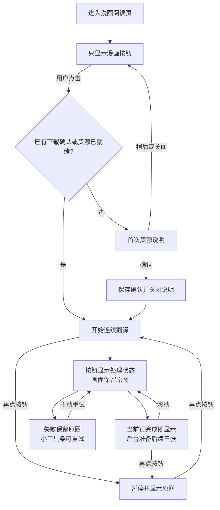

# 漫画安静阅读与 ONNX 告警修复报告

本轮修正 PR #774 的两处干扰：自动出现在右下角的漫画阅读面板，以及遮挡漫画内容的逐图处理卡片。进入、滚动、提前翻译、完成或失败都不会自动打开面板。漫画按钮继续提供状态、暂停和恢复原图；首次下载说明只在用户主动启动且尚未确认资源用途时出现，确认后立即关闭。

## 交互与持久化

| 场景 | 行为 |
| --- | --- |
| 进入已识别漫画网站 | 显示漫画按钮，不弹出阅读面板 |
| 普通悬浮球关闭或被站点名单隐藏 | 可选的独立 40 px 漫画按钮；不再附带右下角面板 |
| 首次主动点击、模型缺失 | 说明约 30 MB 识别资源和按需约 197 MB 修补资源；确认前不下载 |
| 选择稍后、关闭或离开当前路由 | 不启动下载/翻译，迟到的资源检查不能重新打开说明 |
| 确认资源用途 | 保存既有确认偏好，关闭说明并开始；后续启动不重复检查确认 |
| 翻译及提前三张 | 进度留在按钮及其提示文字，不显示逐图进度或取消卡片 |
| 页面失败 | 原图保持可读，按钮显示失败标记，图片保留小型重试入口；不展开错误卡片 |
| 再次点击漫画按钮 | 暂停并恢复原图，再点继续；已准备结果复用规则保持不变 |
| 配置 | 原 `imageTranslationMangaPromptEnabled` 偏好沿用，界面名称改为“独立漫画按钮”；提前页数、语言和服务在设置中调整 |

## 告警根因与处理边界

截图里的 `Unknown CPU vendor. cpuinfo_vendor value: 0` 来自 ONNX Runtime 的 WASM 初始化。浏览器不会向该运行时暴露 CPU 厂商信息；[上游修复 #27399](https://github.com/microsoft/onnxruntime/pull/27399) 已确认并移除了这条 WebAssembly 提示。

FluentRead 继续使用锁定的 ONNX 1.23.2，不修改模型、WASM 二进制、推理后端或全局 console。仅在已有引擎私有 stderr 适配器中，将完整单行、警告级别、`cpuid_info.cc / LogEarlyWarning / vendor=0` 的已知提示转为 `console.debug`。其他 vendor、未知警告、错误/致命级别、模型加载失败、内存错误以及混有失败的多行输出仍保持可见。真实浏览器 Offscreen 已记录该提示为 `debug`，未出现相同的 warning/error。

## 验证与限制

- 针对本次改动的 10 个测试文件共 307 项通过；漫画阶段的原图显示、暂停、错误重试和普通图片反馈分别验证。
- `mangaEntry.ts`、`controls.ts`、漫画文案模块的 statements/branches/functions/lines 均为 100%。测试归类审计、类型检查通过。
- Chrome、Firefox、userscript 构建与 userscript verifier、扩展 manifest verifier、中英文指南文档构建和链接检查通过。未进行浏览器商店发布。
- 入口专项验证实际 MANGA Plus、关闭悬浮球的备用按钮、首次下载确认、关闭与持久设置、窄屏深色、多语言、自定义阅读器和总开关。
- 真实 Pixiv `150354216#1` 与 MANGA Plus `1024050` 使用本地完整校验的模型和在线 Google 文字翻译。两个站点均验证处理过程中没有 FluentRead 面板/逐图卡片、后续页准备、原图暂停和配置持久化。Pixiv 三张正文各处理一次，背后的封面未重复处理；无文字页保留原图。
- 观测到 MANGA Plus 首张约 12.0 秒、当前加三张约 40.8 秒；Pixiv 首张约 25.2 秒、三张约 46.7 秒。模型已导入，数字不包含模型下载，是单次冷启动观测；本轮修改反馈呈现，不宣称提高 OCR 或翻译吞吐。
- 所有浏览器验证使用临时 Edge profile、第二屏正常可见窗口：`macos-background-cdp`、`launchservices-no-foreground`、`background-visible-no-focus`，实测 `browserFrontmost=false`。没有访问用户日常浏览器或账号；Firefox 只验证构建，没有进行真实 Firefox 运行验证。
- UI 首次确认和异常分支含受控阅读器样本；在线章节测试只证明所列样本的实际行为，不代表全部站点、网络、服务或译文质量均已验收。

证据目录：`/Users/thinkstu/Desktop/copy/artifacts/manga-quiet-reading-20261004/`，分别保存 `entry-ui`、`pixiv`、`mangaplus` 的报告与截图。原网站自身的控件和提示保持不变。
