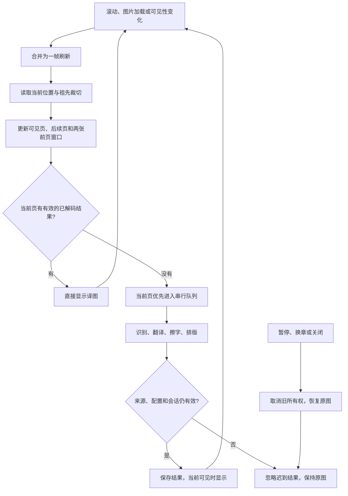

# 漫画滚动稳定性与返页性能报告

本轮修复“第一张处理期间下滑、第二张继续处理、返回第一张却显示原图”的状态交接问题，并保留[安静阅读与告警修复](./manga-quiet-reading-20261004)：不自动打开右下角阅读面板，漫画处理不出现逐图进度卡片；状态留在漫画按钮，失败仍可重试，原图始终能恢复。

## 原因与改动

| 原因 | 影响 | 修复 |
| --- | --- | --- |
| IntersectionObserver 的旧通知直接决定图片是否可见 | 快速滚动时，仍在屏幕中的已翻译页可能被释放 | 每次合并刷新读取当前几何位置、祖先显隐和裁切；观察器只负责唤醒刷新 |
| 已完成前页滚出准备窗口后立即释放 | 来回阅读会反复创建状态；关闭缓存时重复识别 | 最近两张已加载前页保留结果，原始像素预算合计最多 800 万；只保留，不为前页额外启动识别 |
| 返页的缓存恢复与 OCR 共用串行队列 | 即使已有译图，也必须等另一张完成 | 符合来源及配置身份的已解码结果同步显示；只有没有有效结果的页进入识别队列 |
| 长章节中不断积累结果 | 无界保留会增加内存 | 当前可见页、最多五张提前页、两张预算内前页及一个在途旧窗口任务；另沿用最多六张、800 万译图像素的缓存上限 |

原图在离屏时恢复可见，译图仍可按上述边界保留。图片来源、目标语言或服务改变、节点移除、换章或关闭功能会失效旧结果，迟到的处理结果不能重新覆盖新图片或已经暂停的页面。关闭缓存后仍允许保留当前会话附近页面的结果；离开保留窗口后不继续使用缓存。

滚动的一帧内共享祖先样式查询；完全离开视口的页不逐层读取祖先样式。识别与修补保持串行，防止同时启动多个大模型任务。默认提前三张、可设置 0–5 张的行为不变。

## 浏览器证据与性能

同一 macOS 设备使用生产 Chrome MV3 扩展、隔离 Edge 临时 profile、真实本地 PaddleOCR / LaMa。模型从完整校验的离线文件导入；测试期间阻断两个模型下载来源，没有下载请求。MANGA Plus 和 Pixiv 使用在线 Google 文字服务；受控样本只挂起文字服务，识别、清除和译图显示仍走真实扩展链路。

| 对照 | 结果 |
| --- | --- |
| 修复前 PR #779 的生产构建 | 相同受控返页测试失败：第二张文字服务尚未返回时，第一张连续 90 帧未能重新显示译图 |
| 修复后受控阅读器 | 9 项通过；10 次返页 2.2–16.4 毫秒；首张未完成即下滑、关闭缓存、远处缓存恢复、迟到响应、来源失效和换章均验证 |
| MANGA Plus 1024050 | 5 项通过；8 次返页 0.9–16.9 毫秒，往返不增加识别请求；首次当前页约 13.4 秒 |
| Pixiv 150354216 | 5 项通过；8 次返页 7.4–24.5 毫秒，往返不增加识别请求；首次当前页约 32.2 秒；背后的重复封面不参与 |

另外，默认提前三张的受控专项 7 项通过：当前加后三张共四次识别，后续第五/六张及无关图片未处理；已准备页进入视口直接显示，暂停恢复宿主原图，页数 3→0 保存后重新打开仍为 0。共 26 项最终浏览器专项通过。

返页时间在页面内从滚动开始测量，到原图透明且译图接管的首帧结束；随后再核对真实 Shadow DOM 译图位置，并采样 30 帧确认可见页未还原。它表示已有结果的显示延迟，不能与首次 OCR 时间等同，也不是多设备 p50/p95 基准。实页首次加载可能先替换占位图片，因此初始任务计数与滚动后的新增请求分别记录；恢复的是暂停前的网站当前资源。

## 验证边界

- 两个缺陷先用失败测试复现，再修复；覆盖五个处理阶段快速往返、关闭缓存、语言/来源变化、祖先隐藏/裁切、无文字页、标签页隐藏、来源移除、暂停与章节变化。
- 真实浏览器专门验证了“首张未完成就下滑”、第二张处理时返页、最近页面与远处缓存恢复、宿主图片属性和样式恢复，以及没有漫画进度弹窗。
- 所有浏览器使用 `macos-background-cdp`、`launchservices-no-foreground`、第二屏正常可见窗口 `background-visible-no-focus`，`browserFrontmost=false`；只操作临时 profile，结束后清理。
- 首次识别、修补、模型准备及文字服务仍有各自耗时。本轮改善滚动后的结果保留、显示和请求复用，没有更换 OCR 模型，不声称提升所有语种的识别质量或模型吞吐。
- 实页证据限于上述章节与作品；Firefox 验证构建，未进行真实 Firefox 运行、各国网络、所有已登记站点或人工译文质量验收。参考仓库没有修改。

详细测量、针对性测试、构建和证据摘要见[验证记录](../reports/manga-scroll-stability-20261004/verification)。完整本机证据目录：`/Users/thinkstu/Desktop/copy/artifacts/manga-scroll-stability-20261004/`。早期断言失败保留在目录中，最终通过记录使用 `*-verified` 子目录；修复前对照的失败属于预期复现。
