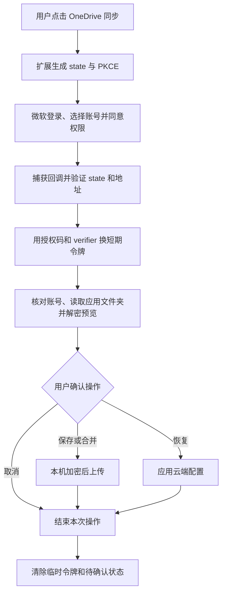
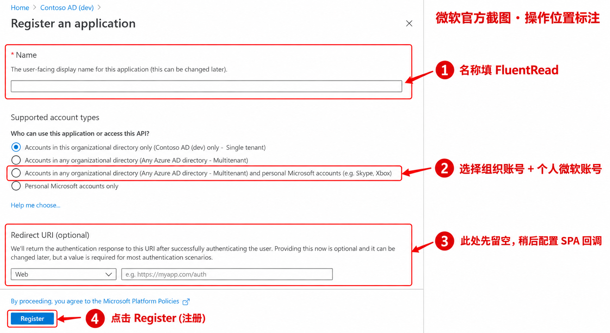
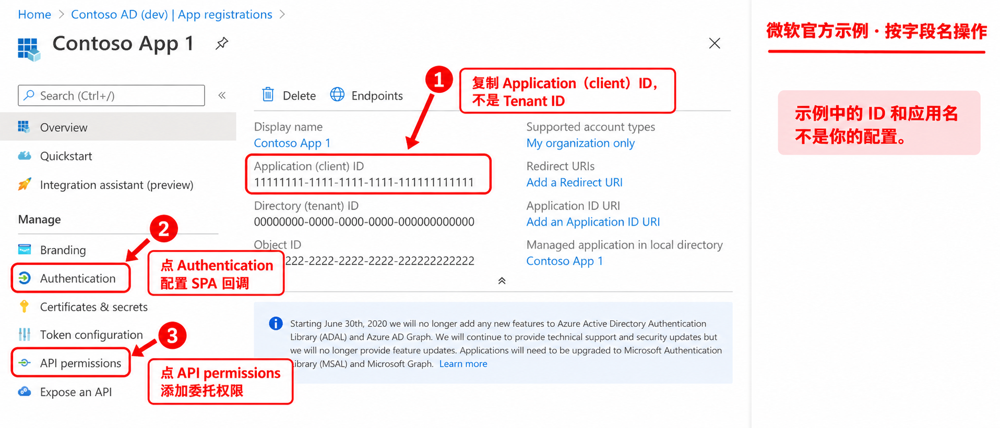
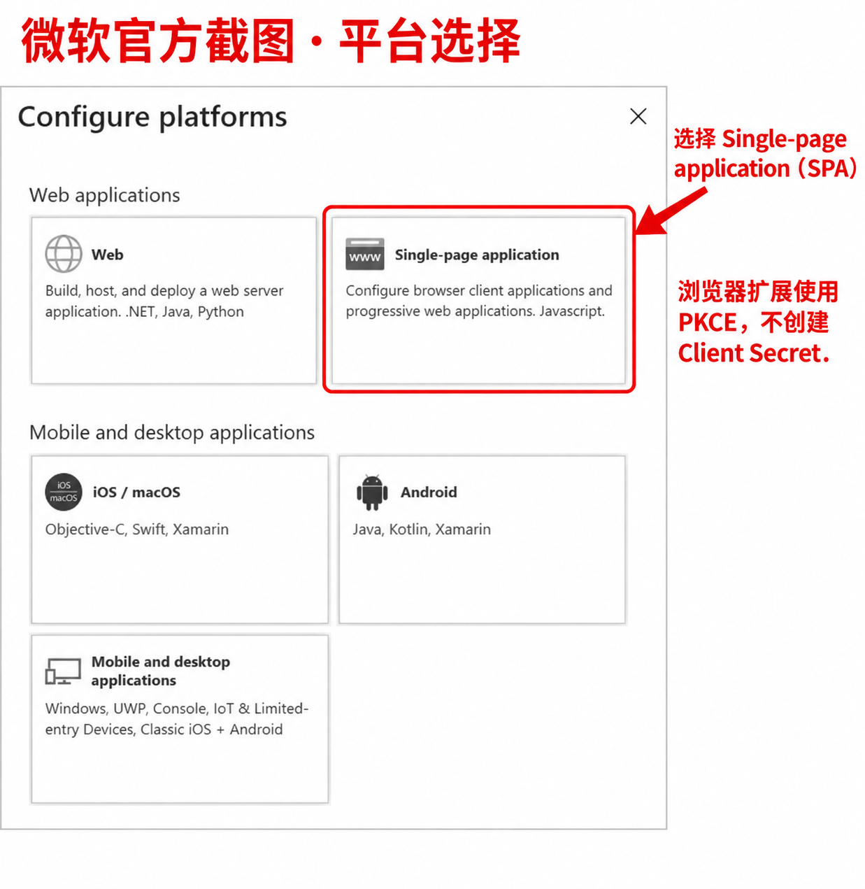
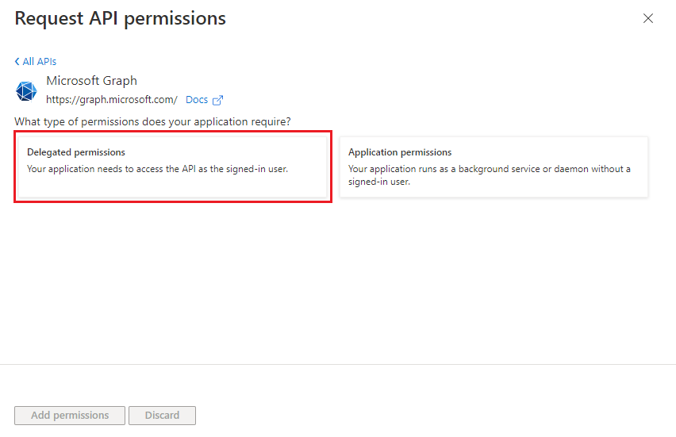
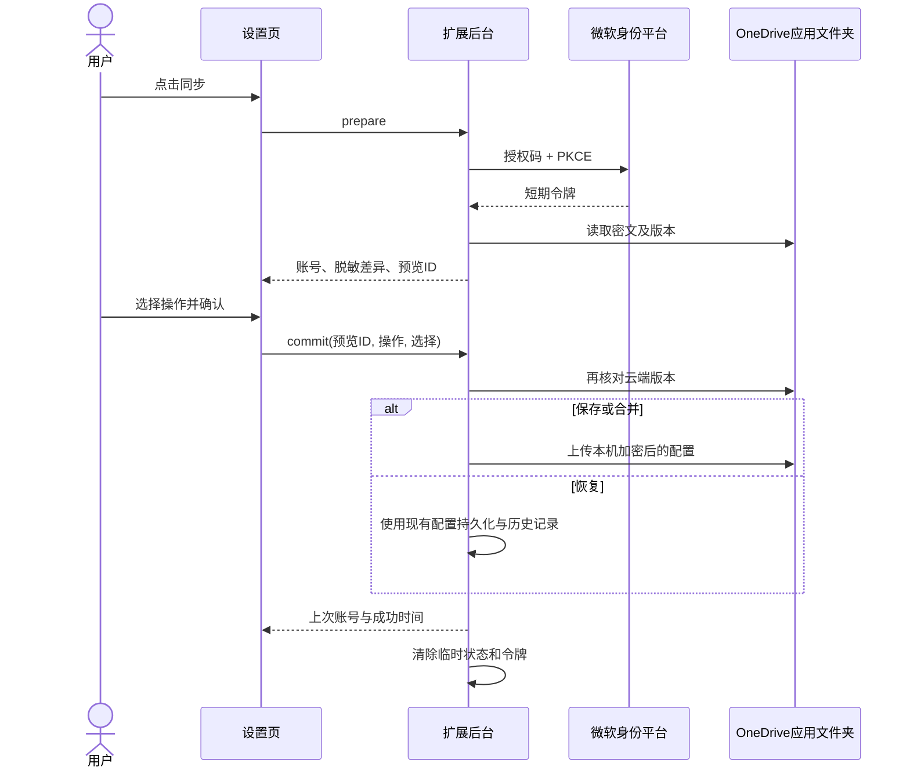

# OneDrive 配置同步：原理、申请与接入教程

核对日期：2026-10-03。适用于本仓库新增的 OneDrive 实现，使用 Microsoft Graph、浏览器身份窗口及授权码 + PKCE。

**你作为开发者创建一次微软应用，填写公开 Client ID 并构建扩展。用户以后只需在设置中点“立即与OneDrive同步”，登录自己的微软账号，确认保存、恢复或合并。用户无需注册应用、填写 Client ID 或输入加密口令。**

当前没有真实的 FluentRead 微软 Client ID。未配置的构建会显示“此版本尚未配置 OneDrive 同步”，不发起授权。本教程用于完成这一前置工作；代码测试与浏览器夹具不代表真实微软账号已经验证成功。

本页属于维护者文档，不进入官网导航或 VitePress 发布输出。用户数据处理说明发布在[隐私政策](../guide/privacy.md)，英文对应[Privacy policy](../en/guide/privacy.md)。

## 1. 背景：为什么增加 OneDrive？

用户可能在 Windows、Edge 或公司微软账号环境中使用 FluentRead，也可能不方便使用 Google Drive。OneDrive 提供另一个由用户自己的账号管理的配置备份位置。两个云盘分别保存文件、账号记录与比较基线；点击 OneDrive 不会自动搬运 Google Drive 文件。

本功能是**主动触发的一次配置同步**，不在后台定时上传。它覆盖翻译服务与模型、语言、外观、快捷键、网站规则、术语与提示词等完整配置。

包含API Key、OAuth Token、鉴权请求头、自定义请求体及URL中的鉴权参数，不包含单词本、聊天记录和用量统计。这里的 OAuth Token 指用户保存的翻译服务凭据；微软同步取得的短期访问令牌不会写入云端备份。

## 2. 文件实际上保存在哪里？

授权后，扩展访问 Microsoft Graph 的 `GET /me/drive/special/approot`，取得当前应用的文件夹。微软首次访问时可创建它，通常显示为：

```text
用户自己的 OneDrive
└── Apps / 应用
    └── FluentRead
        └── fluentread-config.encrypted.json
```

文件夹的名称由 Entra 应用名称决定，不是代码随意创建的共享目录。OneDrive 应用文件夹可以在云盘中看到，与 Google Drive 的隐藏应用数据区不同。应用文件夹支持个人账号和工作/学校账号；公司仍可限制外部应用授权。[微软应用文件夹说明](https://learn.microsoft.com/en-us/graph/onedrive-sharepoint-appfolder)

文件直接通过 HTTPS 在扩展与微软之间传输，不经过 FluentRead 的配置服务器。用户可删除或分享自己的文件夹，所以不要将备份分享给他人。

## 3. 授权原理：Client ID、PKCE 与访问令牌

| 名称 | 作用 | 在本方案中如何处理 |
| --- | --- | --- |
| Application（client）ID | 告诉微软是哪一个应用请求授权 | 公开 UUID，由开发者配置进发行构建；它不是用户密码 |
| Redirect URI | 登录完成后返回扩展的地址 | 从实际扩展的身份接口取得，在微软后台登记成 SPA 回调 |
| `state` | 将回调绑定到这次登录请求 | 每次随机生成，回调必须精确匹配 |
| PKCE verifier/challenge | 防止仅持有授权码的一方直接换取令牌 | 每次生成随机 verifier，提交 SHA-256 challenge，换令牌时证明自己持有 verifier |
| Access token | 代表本次用户授权，访问 Graph | 只在后台内存使用；不交给设置页或写入配置备份 |
| Client Secret | 服务器保管的客户端秘密 | 本扩展不创建、不提交，也不需要用户提供 |
| Refresh token | 可在以后换取新令牌 | 本实现不请求 `offline_access`，不保存刷新令牌 |

浏览器扩展属于公开客户端，不能可靠隐藏 Client Secret。微软规定 SPA 授权码流使用 PKCE；浏览器换令牌的请求需要 SPA 类型的回调配置。代码会携带浏览器 Origin，我们已在隔离 Edge 扩展的本地 HTTP 实验中确认这一点；该实验没有连接真实微软账号。[授权码与 PKCE 官方说明](https://learn.microsoft.com/en-us/entra/identity-platform/v2-oauth2-auth-code-flow)、[公开客户端说明](https://learn.microsoft.com/en-us/entra/identity-platform/msal-client-applications)



如果阅读器没有 Mermaid 插件，代码块仍保留完整流程；操作步骤与下方截图不依赖 Mermaid 才能理解。

## 4. 先准备什么？

| 你准备 | 用户准备 |
| --- | --- |
| 一个有应用注册权限的 Microsoft Entra 目录和开发者账号 | 能使用 OneDrive 的个人或工作/学校微软账号 |
| FluentRead 源码、Node/pnpm、本地扩展构建 | 安装配置了 OneDrive Client ID 的扩展版本 |
| 公开官网与隐私政策 | 登录时同意所需权限；组织可能要求管理员批准 |
| 实际发行扩展的回调地址 | 不需要 Azure 订阅、应用注册或 Client Secret |

### 4.1 能否进入应用注册？

打开 [Microsoft Entra 管理中心](https://entra.microsoft.com/)，登录开发者账号。寻找 **Entra ID → 应用注册（App registrations）**，有些界面先经过“身份（Identity）”菜单。

如果提示不属于任何目录、没有权限，或看不到“新注册”，这不是扩展代码问题。先切换到有权限的目录，或请该目录管理员允许应用注册。普通个人 OneDrive 账号能作为最终用户，并不自动意味着它有一个可管理的 Entra 开发目录。

如确实没有目录，可按[微软创建租户教程](https://learn.microsoft.com/en-us/entra/fundamentals/create-new-tenant)取得可用的 Entra ID 工作人员目录。微软当前对新增 Workforce 租户有资格和订阅限制，免费或试用目录不能直接在管理中心增建普通租户；官方文档另提供 Azure 账号申请入口。不要为了继续教程随意创建付费资源。这里使用普通 Entra ID 应用注册，不需要改成 B2C 或客户 External ID 登录系统。

## 5. 创建 FluentRead 应用：具体点哪里、填什么？

本页图片以**微软官方英文示例截图为基础，用 imagegen 添加中文箭头和圈选**，用于辨认字段，不是你的账号实拍。原图保存在同目录。门户改版后优先按字段名查找；图里的 Contoso、示例 UUID 和已选单租户选项不能照抄。

### 5.1 新建注册

在 **应用注册 → 新注册（New registration）** 中填写：

| 字段 | 填写内容 |
| --- | --- |
| 名称 / Name | `FluentRead` |
| 支持的账号类型 | **任何组织目录中的账号和个人 Microsoft 账号**，即截图第 3 项 |
| 重定向 URI（可选） | 这里先留空，下一步在 Authentication 中添加 SPA 平台 |



图中第 1 个单租户选项保留了官方截图的初始状态；**实际操作时请点击红框中的第 3 项**。完成后点 **Register / 注册**。只选“此组织目录”会阻止其他组织和普通个人账号使用。

注册流程与字段依据：[微软注册应用教程](https://learn.microsoft.com/en-us/entra/identity-platform/quickstart-register-app)、[Graph 应用注册及截图](https://learn.microsoft.com/en-us/graph/auth-register-app-v2)。

### 5.2 找到并复制 Client ID

进入应用的 **Overview / 概述**，复制 **Application（client）ID / 应用程序（客户端）ID**。这是一个类似 `xxxxxxxx-xxxx-xxxx-xxxx-xxxxxxxxxxxx` 的 UUID。



不要复制 Directory（tenant）ID 或 Object ID。图片中的全 1 UUID 是微软的示例，不能用于真实授权。你的 Client ID 可以公开给开发者协助配置，**无需提供 Client Secret、密码或访问令牌**。

### 5.3 获取你这份扩展的回调地址

先按仓库现有方式构建、加载扩展：

```sh
pnpm install
pnpm build
```

Chrome 打开 `chrome://extensions`，开启开发者模式，加载 `.output/chrome-mv3`。进入 FluentRead 的“详细信息”，查看扩展 ID；再从该卡片的 service worker / 检查视图打开**后台控制台**，执行：

```js
chrome.identity.getRedirectURL('onedrive')
```

把结果完整复制下来。官方 Chrome ID 对应的预期值是：

```text
https://djnlaiohfaaifbibleebjggkghlmcpcj.chromiumapp.org/onedrive
```

必须以**实际安装的扩展返回值**为准。开发构建、独立发行的 Edge 扩展或 Firefox 可能返回不同地址。Firefox 后台使用 `browser.identity.getRedirectURL('onedrive')`。每种实际发行身份都要登记自己的回调，不能把 Chrome 地址直接当成 Firefox 地址。

不要填官网、隐私政策地址或 `chrome-extension://.../options.html`，不要删掉 `/onedrive`，也不要加尾部 `/` 或通配符。浏览器截获这个回调，不需要你部署 `chromiumapp.org` 服务器。[Chrome 身份接口](https://developer.chrome.com/docs/extensions/reference/api/identity)、[微软回调地址限制](https://learn.microsoft.com/en-us/entra/identity-platform/reply-url)

### 5.4 添加 SPA 平台与回调

回到注册应用，点 **Authentication / 身份验证 → Add a platform / 添加平台 → Single-page application / 单页应用（SPA）**。



将 5.3 得到的完整地址填入 **Redirect URIs / 重定向 URI**，保存。需要支持多个扩展身份时，在 SPA 平台中逐条添加，不覆盖已经验证过的地址。

**不要选择 Web，也不要选 Mobile and desktop applications 代替 SPA。**本实现由扩展浏览器环境换令牌。无需勾选隐式授权的 Access tokens / ID tokens；无需在“证书和密码”中新建秘密，也无需打开旧式公共客户端密码流。

### 5.5 添加两项 Microsoft Graph 委托权限

点左侧 **API permissions / API 权限 → Add a permission / 添加权限 → Microsoft Graph → Delegated permissions / 委托权限**。



这张原图来自微软 Teams 文档，仅借用 Graph 权限类型界面；它不表示我们注册 Teams 应用。FluentRead 选择“委托权限”，即代表当前登录的用户操作其自己的文件，而不是服务器后台替全组织操作。

依次搜索并添加：

| 权限 | 用途 |
| --- | --- |
| `Files.ReadWrite.AppFolder` | 读取和更新 FluentRead 的应用文件夹 |
| `User.Read` | 读取当前登录用户的 ID，以及返回时的邮箱/用户主体名，显示账号并防止混用备份 |

注册时常默认带有 `User.Read`，已有就保留，不重复添加。不要添加 `Files.ReadWrite.All`、邮件、联系人等权限。应用文件夹权限定义见[Graph 权限参考](https://learn.microsoft.com/en-us/graph/permissions-reference#filesreadwriteappfolder)；操作入口见[配置 API 访问权限](https://learn.microsoft.com/en-us/entra/identity-platform/quickstart-configure-app-access-web-apis)。

是否需要“授予管理员同意”取决于组织的策略。个人账号由用户本人同意；工作/学校账号可能被要求管理员批准。不要将“按完发布按钮就能支持所有公司账号”当成承诺。

### 5.6 品牌、主页与隐私政策

在 **Branding & properties / 品牌与属性** 中使用 `FluentRead` 名称，可添加项目标志和支持联系人；官网主页填 `https://read.thinkstu.com/`，隐私政策填 `https://read.thinkstu.com/guide/privacy`。提交前匿名打开两页，确认无需登录且已展示 OneDrive 的数据处理说明。

微软应用注册没有 Google OAuth 那种相同的“测试用户 → 发布到正式环境”开关。允许哪些账号主要由账号类型、回调、权限、用户同意及组织策略决定；发布者验证、企业管理员政策也会影响授权体验。[应用注册说明](https://learn.microsoft.com/en-us/entra/identity-platform/quickstart-register-app)

## 6. 把 Client ID 配置进 FluentRead

在仓库根目录复制 `.env.example` 到 `.env.local`，填写：

```dotenv
WXT_ONEDRIVE_CLIENT_ID=你的公开Application-client-ID
```

将中文占位内容替换成你 5.2 复制的 UUID。该值在构建时写入扩展，不是安装后动态读取的服务器配置。不要填写 Tenant ID、Client Secret 或用户 Token。`WXT_` 环境变量由项目锁定的 WXT 0.20.18 构建处理；对应[WXT 环境变量文档](https://wxt.dev/guide/essentials/config/environment-variables.html)。

重新构建并在扩展管理页面重新加载：

```sh
pnpm build
pnpm build:firefox
```

如果在 GitHub Actions 或其他构建环境打包，也要给**实际执行 WXT 构建的进程**设置同名变量；只在本机 `.env.local` 填写不会让远端发行包自动生效。Client ID 是公开标识，可使用构建平台变量。普通用户不需要各自申请 ID。

配置位置对照：

| 代码 | 职责 |
| --- | --- |
| `src/platform/onedrive/constants.ts` | Client ID、权限、微软地址、独立状态键 |
| `src/platform/onedrive/auth.ts` | 授权窗口、state、PKCE、短期令牌、账号校验 |
| `src/platform/onedrive/api.ts` | 应用文件夹、密文读写、版本校验、超时与大小限制 |
| `src/app/background/googleDriveSyncRuntime.ts` | 按提供商装配后台，复用现有配置存储和修改队列 |
| `src/services/config/googleDriveSync.ts` | 共用确认事务、快照与合并逻辑 |
| `src/features/settings/ui/CloudConfigSync.vue` | 共用两步预览界面，只接收脱敏数据 |

## 7. 用户实际怎么用？

1. 打开 **设置 → 备份与恢复 → OneDrive 配置同步**，点击“立即与OneDrive同步”。
2. 微软窗口让用户选择账号、登录并允许必要权限。扩展不会自动勾选或代替用户同意。
3. 扩展核对账号、读取应用文件夹，显示本次账号和配置预览。可以点“更换 Microsoft 账号”，结束当前预览并重新选择。
4. 云端没有文件时，明确确认保存本机配置。已有文件时先选择“恢复云端配置”或“保存本机配置”，再检查替换范围；希望保留两边部分修改时进入“逐项合并”。
5. 恢复会替换本机设置与服务凭据；保存会替换云端配置。私密内容不会直接出现在差异列表。
6. 确认后才修改配置或上传；“取消”结束本次操作。完成后显示上次成功同步账号与时间，不显示持续连接状态或退出登录按钮。

本次授权的内存缓存会清理，但微软账号在浏览器中的登录状态及已经授予应用的同意不会因此退出或撤销。每次点击仍重新进入账号选择；在 worker 休眠、令牌过期等情况下，确认阶段可能需要重新授权或重新预览。



## 8. 安全与同步边界

上传前使用 AES-GCM 加密，配置明文最多 20 MiB，上传密文最多 32 MiB。签名传输地址仅用于这次请求，扩展不会向它们附加 Graph 的 Bearer Token；代码也不将这些地址或令牌输出到日志。

**固定应用口令 `FluentReadEncryption` 随源码公开。它免去用户输入口令，但不是用户独享的秘密；拿到密文的人可以解密。**因此保护主要依赖微软账号、授权范围和设备安全，不能宣传为开发者或其他持有文件的人无法解密的端到端加密。

预览绑定设置页、客户端和账号，10 分钟失效；本机或云端配置变化后要重新预览。现有文件通过上传会话的 `If-Match` 检查版本，创建新文件使用同名冲突失败策略。一次配置同步包含云端写入、本机应用和本机状态记录，不能把它描述成跨设备数据库的原子事务。尤其不要在两台设备上同时确认覆盖；若请求中断后无法确认结果，重新预览，并按需使用 OneDrive 文件版本历史恢复。[上传会话协议](https://learn.microsoft.com/en-us/graph/api/driveitem-createuploadsession?view=graph-rest-1.0)

Google 和 OneDrive 之间没有自动搬运或双向联动。你可以先将某个云端配置恢复到本机，再自行确认保存到另一个云盘。

## 9. 你创建应用后，怎样验收？

以下真实验收需要你完成注册后执行，不能用夹具通过代替：

| 场景 | 应看到的结果 |
| --- | --- |
| 个人微软账号首次使用 | 能登录、允许权限，并保存到自己的应用文件夹 |
| 第二份干净扩展/另一台设备 | 登录同一账号后能预览、恢复完整配置及服务凭据 |
| 换账号 | 预览显示新账号；不会复用另一账号的合并基线 |
| 取消登录或预览 | 本机配置和上次成功记录不变化 |
| 在预览后修改本机配置 | 确认被拒绝，要求重新预览 |
| 在另一个设备修改云端文件 | 旧预览被拒绝或返回冲突，不偷偷重试覆盖 |
| 两边各自修改、合并 | 单侧修改可保留，冲突项由用户明确选择 |
| 工作/学校账号 | 能登录并访问已初始化的 OneDrive；若策略要求批准，显示管理员需求 |
| 中文、英文、深色、小屏 | 账号、确认范围、错误与取消按钮可读；页面无横向溢出 |

先使用不含真实生产密钥的测试配置。成功后再打包相同 Client ID、相同扩展身份的发行版本，并复核包里的配置。回调地址跟扩展身份绑定，不能只验证一份本地开发扩展就认为全部商店包已可用。

## 10. 出错时查哪里？

| 错误或现象 | 优先检查 |
| --- | --- |
| 此版本尚未配置 OneDrive | `WXT_ONEDRIVE_CLIENT_ID` 是否为真实 UUID，是否重新构建和加载 |
| `AADSTS50011` / redirect mismatch | SPA 回调是否和 `getRedirectURL('onedrive')` 返回值完整一致 |
| `AADSTS9002326` / cross-origin token redemption | 是否误选 Web 或桌面平台；本实现要求 SPA + PKCE |
| 个人账号不能登录 | 是否选了“任何组织目录 + 个人账号”，并使用 `common` 授权入口 |
| 需要管理员批准 / 403 | 工作/学校组织的用户同意策略、权限授权及租户限制 |
| 账号 OneDrive 不可用 | 先登录 OneDrive 网页初始化，确认该组织用户有相应服务 |
| 找不到权限选项 | 确认选择 Microsoft Graph → Delegated permissions，再搜索完整权限名 |
| 云端配置变化 / 409 / 412 | 重新预览再决定，勿绕过版本检查自动覆盖 |
| 授权过期 | 重新点击同步、选择账号；不靠保存刷新令牌保持连接 |
| 网络失败但云端可能已保存 | 重新预览确认当前文件；失败不表示所有远端写入一定没发生 |
| 无法解密 / 文件损坏 | 本机保持原配置，先保留文件副本，再检查版本历史或重新备份 |

排查时只提供公开 Client ID、去除账号信息后的错误代码及扩展回调。不要在 issue 中上传授权 URL、签名上传/下载链接、Token、配置密文或包含真实鉴权参数的截图。

## 11. 图片与官方资料

图片来源、原图、标注方式见[图片说明](./onedrive-sync-assets/README.md)。本教程对应项目代码的实际协议，图片负责指示位置；门户版本差异通过中英文字段名和官方链接核对。
