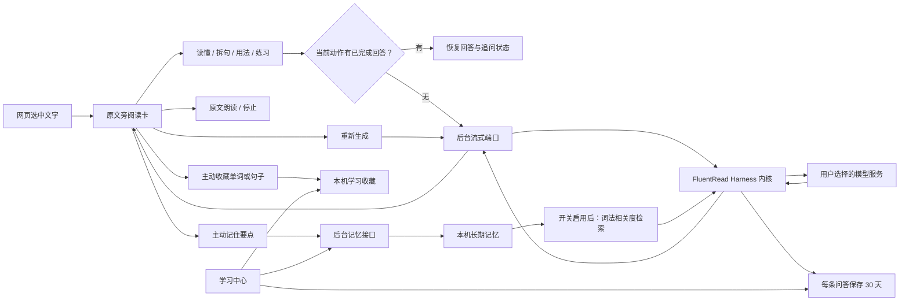

# 学习中心、阅读缓存与可选记忆

本次将网页旁的学习动作、长期收藏和阅读记录串成一个学习流程。初始开发基线是 `origin/main@262d2a1`，交付前已依次整合 PR #447、#449、#452、#451 和 #453，最终基线为 `origin/main@ebd3aef`，分支为 `codex/harness-actions-audio-20260905`。已有 Harness 内核来源见[内嵌代码地图](./harness-embedding-map-20260905.md)；本次没有替换其模型网关或升级依赖。

## 用户反馈与实现

| 反馈 | 实现 |
| --- | --- |
| “设置模型”没有反应 | 后台合法分区由设置导航注册表派生，修复遗漏 Harness 等新分区。错误卡进入翻译服务，页脚设置进入 Harness；负响应也会显示可操作的提示。 |
| 设置页地址改变但内容不切换 | Options 页持续同步 hash 深链接及浏览器前进、后退，复用同一导航注册表，旧学习入口继续可用。 |
| 练习切走再切回来又请求 | 当前卡片按动作保存最后成功回答及追问状态，切换恢复缓存；“重新生成”独立发起当前动作的新分析。更换原文、上下文或配置会失效。 |
| 原文没有朗读 | 原文旁增加喇叭与停止状态，复用已有语音通路；恢复旧记录或理解整句后朗读当前显示的原文。 |
| 更多设置被折叠 | 网页动作、学习程度、回答长度和上下文范围保持常驻独立分组。 |
| 单词本和 Harness 入口割裂 | 工具与学习统一为翻译中心 → 学习中心 → 术语库 → 模型用量；Harness 配置放入基础配置。学习中心包含收藏、阅读记录和学习记忆。 |
| 只能收藏英文单词 | 收藏支持多语种单词、短语与句子，允许先收藏没有 AI 释义的原文。每条收藏可朗读，保留旧复习状态和 v1 导入导出。 |
| 希望可选接入记忆插件 | 采用社区 `dsh-agent-memory` 的纯检索子集，增加默认关闭的学习记忆。用户主动保存、编辑和删除；开启时用于后续相关回答。 |

## 产品地图

## 记忆插件究竟用了什么

上游是社区项目 [Culeot/dsh-agent-memory](https://github.com/Culeot/dsh-agent-memory/tree/af709743fb267b536d11343bab43e9a54f96367c)，包版本 `0.8.4`，固定提交 `af709743fb267b536d11343bab43e9a54f96367c`，MIT 许可。它不是 DeepSeek 官方独立内置记忆包。

| 上游模块 | 本次处理 |
| --- | --- |
| `src/search.ts` 的查询检索 | 实际采用纯代码子集：中英文 token、中文 bigram、Jaccard、BM25 频率信号、相关度解释、过期过滤与排序。 |
| `src/spec.ts` 的记录结构 | 保留检索所需的 MemoryRecord 类型形状；FluentRead 自己保存精简的学习分类和毫秒时间字段，召回前适配。 |
| `src/index.ts` 的插件与文件存储 | 未引入；以后台注入与 IndexedDB 事务适配浏览器环境。 |
| `src/rpc.ts` 与 React 客户端 | 未引入；复用扩展消息，使用 Vue 学习中心管理。 |
| 模型写入、自动沉淀、错误提炼、磁盘 reload/import | 未引入。记忆只能由用户主动保存；不存在自动收集历史或模型自行改写长期个人记忆。 |
| hot memory、旧版 tokenizer/兼容评分导出 | 未引入未使用的代码；最近一条学习偏好由 FluentRead 明确选取，其他记录按相关度排序。 |

这属于检索内核的浏览器适配，不是完整社区插件的即插即用装载器。纯检索不调用网络或 embedding；它是词法相关度计算，不是向量语义检索。完整授权文本随发行包放在 `public/third-party-notices/dsh-agent-memory-MIT.txt`，源码头注明固定来源及核查文件摘要。

## 代码位置

| 位置 | 职责 |
| --- | --- |
| `src/features/reading-assistant/ui/ReadingPanel.vue` | 动作缓存、强制重新生成、原文朗读事件、收藏与主动记忆入口。 |
| `src/features/selection-translation/ui/SelectionTranslator.vue` | 阅读卡与已有 TTS、配置和生命周期的连接。 |
| `src/features/settings/ui/LearningCenter.vue` | 收藏、阅读记录和学习记忆三个栏目。 |
| `src/features/settings/ui/LearningMemoryManager.vue` | 本地记忆查看、搜索、添加、编辑、删除和清空。 |
| `src/features/reading-assistant/ui/HarnessReadingHistory.vue` | 从 Harness 设置抽出的共享阅读历史。 |
| `src/features/settings/model/navigation.ts` | 导航分组顺序与旧链接兼容。 |
| `src/app/options/OptionsApp.vue` | 设置页布局、学习中心装配与 hash 导航生命周期。 |
| `src/features/settings/background/openOptionsHandler.ts` | 按导航注册表校验设置跳转。 |
| `src/features/vocabulary/learningModel.ts`、`repository.ts`、`ui/VocabularyBook.vue` | 原文规范化、兼容旧收藏数据、句子复习与朗读。 |
| `src/core/harness/memorySearch.ts` | 社区插件纯检索代码子集。 |
| `src/services/harness/learningMemory.ts`、`memoryRecall.ts` | 记忆合同、输入规则、本机字段适配及最多三条召回。 |
| `src/platform/storage/learningMemoryRepository.ts` | `FluentReadLearningMemories` 数据库、容量、事务、持久删除代次。 |
| `src/features/reading-assistant/memoryHandler.ts`、`client.ts` | 消息权限与 UI CRUD；内容脚本只可新增，设置页可管理。 |
| `src/services/harness/runtime.ts`、`conversation.ts` | 在开关与隐私边界内把记忆作为数据传入所选模型；读取超时或失败可继续阅读。 |
| `src/app/background/harnessRuntime.ts` | 装配会话、记忆仓库、召回与消息路由。 |
| `src/core/config/harness.ts` | `memoryEnabled` 默认关闭、规范化和持久配置合同。 |

## 数据与使用边界

| 数据 | 保存方式 | 保留期限 | 何时发送模型 |
| --- | --- | --- | --- |
| 动作回答缓存 | 当前阅读卡内存 | 当前原文和配置生命周期 | 恢复缓存不请求模型 |
| 阅读问答 | 原有会话 IndexedDB | 每条创建起 30 天 | 用户明确继续追问时携带近期问答 |
| 学习收藏 | 原有词库 IndexedDB | 主动删除前 | 收藏本身不请求模型 |
| 学习记忆 | 独立本机 IndexedDB | 主动删除前 | 开关开启后的新回答，最多三条、每条 700 字符 |

学习记忆最多 200 条，每条 2000 个字符，精确重复创建幂等。新问题优先使用最近一条学习偏好，其余按相关度补齐；关闭开关不删除已存记忆。隐私窗口完全禁止读取和写入。删除或清空递增数据库内的持久代次，迟到保存不能复活旧数据；记忆修改后会取消当前请求。记忆以有界 JSON 数据进入模型上下文，不能授予新工具或改变当前语言、任务及权限。

现有备份包含学习收藏；本次没有扩展备份格式以包含学习记忆。

## 验证

- 最新 main 整合后测试审计：235 个文件、2973 个声明用例通过。
- 最新 main 整合后全量测试：235 个文件、4410 项通过。
- 最新 main 整合后严格覆盖率：186 个测试文件、3550 项通过；纳入覆盖率的业务模块 statements / branches / functions / lines 均为 100%。
- TypeScript/Vue 类型检查、Chrome MV3 和 Firefox MV2 构建、清单验证、userscript 构建与 verifier、文档站点构建通过。
- 真实 IndexedDB 回归覆盖：练习出题后切换其他动作 5 轮，恢复缓存练习后追问仍由后台验证的 `anchorTurnId` 指向该题；未知或异动作标识在创建问答或调用模型前拒绝。

最终 `main@ebd3aef` 基线上再次完成 **4/4 浏览器补验**：[最终浏览器报告](./harness-learning-center-20260905/delivery-browser/report.json)。关闭重开、连续四次修改、真实退出时未完成保存交接，以及 HTML 弹窗内选句阅读和原文播放/停止均通过；控制台与 HTTP 错误为 0，`browserFrontmost=false`。四张截图已人工检查，确认 Harness 位于基础配置，图片与圈选入口独立，阅读卡完整处于弹窗内。侧栏末项和首屏下方的更多设置不在这些截图的完整视野内，其顺序与常驻行为由对应导航/组件回归和此前完整轮验证。使用相同的集成 wrapper，未修改业务断言。449 个来源文件逐一验证摘要一致，见[最终浏览器来源](./harness-learning-center-20260905/delivery-browser/build-provenance.json)。

整合 PR #447（`166253c`）后重新构建并完成 **4/4 浏览器补验**：[集成报告](./harness-learning-center-20260905/integrated/report.json)。原有关闭后重开、连续四次修改最终值胜出、真实 beforeunload/pagehide 后批量交接保存全部通过；另外在 HTML `showModal()` 弹窗内真实选句，验证阅读卡迁入弹窗、一次模型回答及原文 TTS 播放/停止。该轮控制台与 HTTP 错误为 0，`browserFrontmost=false`；四张截图均已人工检查。

该轮源码与产物逐文件摘要见[集成轮构建来源](./harness-learning-center-20260905/integrated/build-provenance.json)。本轮以正式 runner 的 `--persistence-only` 三项为基础，通过[诊断 wrapper](./harness-learning-center-20260905/integrated-diagnostic-wrapper.original.txt)追加 HTML 弹窗验证；wrapper 未修改原有断言。复现时将其入口路径改为当前 checkout 的正式 runner。它不使用操作系统确认框，也不属于 Firefox UI 验证。

随后并行合入的 #449 增加机器翻译回退，#452 增加简繁中文区分；独立审查确认免费翻译链不会接管 Harness。#452 会让字形不确定的中文返回 `cmn`，本次补齐仅用于语音的 `cmn/zho/chi → zh-CN` 映射，明确繁体仍用 `zh-TW`，不据此跳过简繁翻译。真实语言检测到有效音色的回归通过；最终基线重新执行全量测试、严格覆盖率、类型及各构建。随后还整合了 #451 的视频设置和 #453 的圈选翻译，保留新增的圈选入口及独立图片翻译入口。本次未重复完整浏览器矩阵，早期浏览器证据对应其明确记录的基线。最终来源提交与 Chrome/Firefox/userscript 文件摘要见[交付构建记录](./harness-learning-center-20260905/delivery-build.json)。最终测试使用 2 个 worker 和 15 秒通用调度超时，业务断言与性能阈值不变；此前冷编译及大型 ZIP 测试夹具出现的 5 秒超时已重跑通过。

整合新 main 前的生产 Chrome 包累计通过 **49 个不同场景**，见[逐项汇总](./harness-learning-center-20260905/combined-functional-coverage.json)：完整轮通过 48 项后，在最后新建设置页时被前台焦点保护中止；记忆专项 10 项全部通过，覆盖该轮未完成的关闭后重开步骤。两轮源码和 Chrome 产物摘要完全相同，不能将此结果表述为“单轮 49 项全部通过”。[完整轮原始报告](./harness-learning-center-20260905/full/report.json)与[记忆专项原始报告](./harness-learning-center-20260905/memory/report.json)均保留。

浏览器为独立临时 Edge，`launchMode=macos-background-cdp`、`focusPolicy=launchservices-no-foreground`、窗口正常显示于第二显示器。记忆专项全程完成且记录 `browserFrontmost=false`；完整轮启动状态同样为 false，但后续检测到测试进程处于前台并停止，不能仅引用启动值声称全程未抢焦点。所有测试窗口与临时 profile 已关闭。最终两轮控制台和 HTTP 错误均为 0；最终完整轮 17 张截图及专项补充图已人工查看。

为防止自动化打开设置时激活桌面，两个设置按钮测试在浏览器 API 边界使用 CDP 预建真实页，再调用真实 `tabs.update(url, active:false)`；按钮、扩展消息、后台 URL 及实际页面内容仍被验证，操作系统前台激活不属于该适配的验证范围。此前未适配的运行也确认了两个按钮能通过原生 `tabs.create` 打开正确页面，但因焦点变化中止。音频验证沿用真实后台、offscreen 和播放/停止链路，合成 HTTP 返回静音 WAV，并未验证真人听感。模型是本地 SSE 测试服务，覆盖真实流式、工具循环、请求数量及 IndexedDB；不代表逐一验证所有远程模型的回答质量。Firefox 已构建并核查清单，本次未做真实 Firefox UI 验证。

旧版技能脚本的 production `--suite full` 也已执行，但在寻找“默认目标语言”控件时超时：[原始日志](./harness-learning-center-20260905/legacy-full-ui.log)。该外部脚本的定位名称已过时；开发基线 `origin/main@262d2a1` 与当前代码都将此控件标记为“语言”。这项未通过，未计入通过数。全部确定性结果见[验证摘要](./harness-learning-center-20260905/validation.json)。

上述整合前轮次的源码摘要：`738d85772c4e74b78442c3140a64d18503fff1b43028c00d81f9b6f1e7abc1d9`；Chrome 产物摘要：`a054b5da6c94eca9d872f17d85e541b8e650466d779b0296ddcf9a859db6bec2`。439 个来源文件在该轮完成时逐一复核相同，详见[构建来源](./harness-learning-center-20260905/full/build-provenance.json)。这些摘要不代表整合后的新 main 产物。证据中的临时目录保留为当时运行位置；本报告目录同时归档对应 JSON 和 PNG。

专项通过[原始诊断 wrapper](./harness-learning-center-20260905/memory-diagnostic-wrapper.original.txt)运行正式 `scripts/run-harness-reading-test.cjs` 的记忆段。复现时将 wrapper 的 `script` 改为当前 checkout 中该文件的绝对路径，并使用与正式 runner 相同的扩展、Playwright、隔离 helper 和证据目录参数。wrapper 从 `memoryPage` 起至文件末尾原样保留，仅移除无关前置测试并将上下文配置设为 selection。其诊断文字“排除 43 项”不准确：实际保留 10 项、排除 39 个不同场景；断言未修改。

## 界面证据

学习记忆列表是可编辑内容的纯文本预览，可能显示保存回答中的 Markdown 标记；阅读回答和阅读记录详情使用 Markdown 渲染。流式过程中未闭合的 Markdown 标记可能短暂出现，完成后按结构展示。
