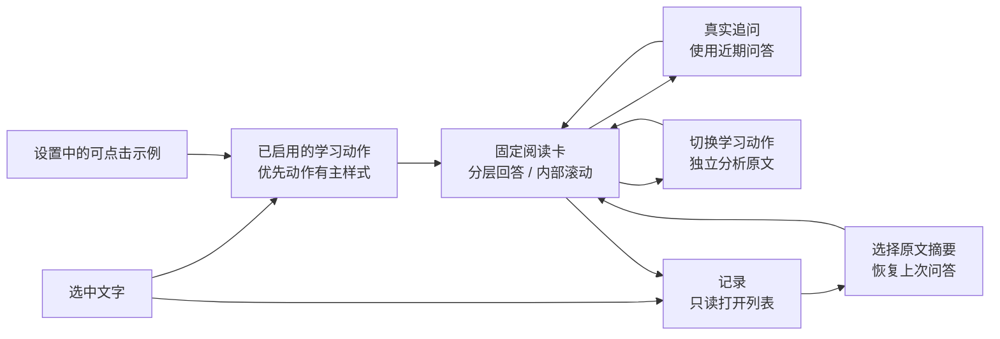

# Harness 阅读交互修复与验证

开发基线为 `origin/main@5704bb848347c2dcd2791c1bf702c59f3b8dc5ca`，工作分支 `codex/harness-reading-ux-20260905`。本次针对实际试用反馈修复阅读流程；内嵌来源、模块取舍和代码位置另见[内嵌方式与代码地图](./harness-embedding-map-20260905.md)。发布状态以 [PR #446](https://github.com/FluentRead/FluentRead/pull/446) 为准。

## 同步最新 main 后的合并前验证

合并前已无冲突同步到 `main@a70f27e1f3256c2988619147f5f996a0397d4bab`，保留主线新增的网站适配规则、设置入口与模型用量页面；以下是同步后重新运行的结果，后文保留初次实现的验证记录。

- 全量测试：211 个文件、3,683 个测试通过；测试审计：211 个文件、2,566 个声明用例通过。
- 严格覆盖率：166 个测试文件、2,933 个测试，statements / branches / functions / lines 均为 100%。
- 类型检查、Chrome / Firefox 构建、扩展清单、userscript 构建与 verifier、文档站点构建通过。
- 同步后的 Chrome 生产包在独立 Edge 中通过全部 30 个 Harness 场景，控制台和 HTTP 错误均为 0，首次生成与追问的卡片 x/y 位移均为 0。
- 独立审查未发现阻断问题，已核对新站点规则配置与 Harness 设置兼容、动作/追问隔离、异步记录恢复、取消与 Markdown 呈现边界。

最新证据：[浏览器结果](./harness-reading-ux-20260905/integration-browser-report.json)、[生产入口摘要](./harness-reading-ux-20260905/integration-build-provenance.json)、[阅读卡](./harness-reading-ux-20260905/integration-harness-reading-panel.png)、[记录详情](./harness-reading-ux-20260905/integration-harness-settings-history-detail.png)。Firefox 的真实交互及旧完整 UI 脚本的定位限制仍按后文说明，不扩大为已通过。

## 七项反馈对应结果

| 用户问题 | 实现 | 验证证据 |
| --- | --- | --- |
| 追问时气泡上下弹跳 | 阅读模式使用固定可视尺寸；正文内部滚动，位置计算不再依赖回答长度。旧翻译继续使用原定位方式 | 真实生产包首次生成 285 个布局样本、追问 245 个样本，x/y 位移均为 0；390px 窄屏卡片仍在可视边界内 |
| 读懂、拆句难以阅读 | 四动作分别采用短标题和原文证据；共用 Markdown 组件渲染标题、列表、强调、代码、引用和简单表格 | 浏览器实际检查标题、列表与强调元素；查看完整阅读卡截图 |
| 拆句回答被旧上下文带偏 | 动作分析与真实追问分开；空问题的动作不注入历史问答，删除诱发元叙述的“既有问答”前缀；保存仍在同一记录中 | runtime 与 conversation 双层回归；真实拆句、用法、练习请求只含当前原文用户消息，不包含先前的用户/助手问答 |
| 最近会话不直观 | 改为“阅读记录”，列表说明可继续上次问答，显示原文、动作、日期、轮次；独立列表可返回当前阅读；保留选区工具条直接查看记录且不请求模型 | 打开列表、返回当前回答、关闭重选、恢复记录及带历史追问均通过 |
| 设置中历史显示为原始 Markdown | 列表只展示摘要；点击后进入独立原文与问答详情；详情、网页回答、示例共用 ReadingAnswer | 实际列表进入详情，验证 Markdown 标题、强调、引用；单删、清空、生成中清空不复活、删除后分页通过 |
| 浮条动作与设置不一致 | 工具条直接展示已启用动作，优先动作有主样式；记录按钮次要显示，隐私模式隐藏 | 真实修改动作 checkbox 与默认动作，验证配置持久化、示例与网页浮条一致，原划词翻译仍共存 |
| 设置缺少直观示例 | 主区为启用、可点击的例句演示和自由服务/模型选择；其余偏好收进“更多设置”，用具体用途解释上下文 | 四种示例切换不请求模型；390px、暗色、关闭重开持久化均通过 |

继续保留真实流式正文、停止及部分回答、重试、复制、显式单词收藏和每条问答 30 天的本地保存规则。恢复失败记录会说明上次失败并提供重试；恢复中断动作时不会把“拆句”等记录标签误当成新的追问。

## 实现位置

- `src/features/selection-translation/core.ts`：独立的阅读卡可视尺寸与位置计算。
- `src/features/selection-translation/ui/SelectionTranslator.vue`：真实动作工具条、优先动作、只读记录入口、固定阅读外壳。
- `src/features/reading-assistant/ui/ReadingPanel.vue`：阅读与记录列表切换、内部滚动、追问、恢复失效保护及单次入口调度。
- `src/features/reading-assistant/answerFormat.ts`、`ui/ReadingAnswer.vue`：受限 Markdown 结构与共用 Vue 呈现；不执行 HTML、不加载外链图片。
- `src/services/harness/runtime.ts`、`conversation.ts`：四动作提示词及动作/追问的历史隔离。
- `src/features/settings/ui/HarnessSettings.vue`：例句示范、简化设置与独立阅读记录详情。
- `scripts/run-harness-reading-test.cjs`：使用真实扩展、模型 SDK、工具循环、流式端口和 IndexedDB 的浏览器回归。

## 验证与限制

测试审计通过：205 个文件、2,497 个声明用例。最终全量测试通过：205 个文件、3,374 个测试。严格覆盖率通过：160 个测试文件、2,626 个测试，statements / branches / functions / lines 均为 100%。类型检查、Chrome 与 Firefox 构建、扩展清单验证、userscript 构建与 verifier、文档站点构建通过。

生产 Chrome 包在临时独立 Edge profile 中完成 **30 个 Harness 场景，全部通过**。控制台与 HTTP 错误均为 0。`launchMode=macos-background-cdp`、`focusPolicy=launchservices-no-foreground`，窗口位于第二块屏幕且 `browserFrontmost=false`。测试未连接用户日常 profile。全部 9 张截图已经人工复核。

完整 UI skill 的旧 `--suite full` 脚本另行执行，但在通用设置的“默认目标语言”旧定位上超时，未进入完整验证，**不计为通过**；日志保存在 [full-ui-runner.txt](./harness-reading-ux-20260905/full-ui-runner.txt)。Harness 专项并未跳过失败用例，其 30 项包含实际设置操作、持久化、阅读记录和页面行为。

浏览器模型响应使用本地分段 SSE fixture，验证链路与发送给模型的消息，不能证明所有远程模型的回答质量。Firefox 本轮完成构建与清单检查，未执行真实 Firefox 交互。布局采样覆盖中部选区的首次生成、追问和窄视口，不将这些结果扩大为所有网站或所有缩放比例的验证。

## 可查看的证据

[完整浏览器结果](./harness-reading-ux-20260905/report.json)包含逐场景结果、布局指标、请求数据和待测产物路径。[生产入口摘要](./harness-reading-ux-20260905/build-provenance.json)记录待测扩展的 manifest、后台和内容脚本 SHA-256。

- [完成的阅读卡](./harness-reading-ux-20260905/harness-reading-panel.png)
- [生成过程中的正文](./harness-reading-ux-20260905/harness-reading-partial.png)
- [390px 阅读卡](./harness-reading-ux-20260905/harness-reading-390.png)
- [重开后的设置首屏](./harness-reading-ux-20260905/harness-settings-reopened.png)
- [Markdown 阅读记录详情](./harness-reading-ux-20260905/harness-settings-history-detail.png)
- [390px 设置](./harness-reading-ux-20260905/harness-settings-390.png)
- [暗色设置](./harness-reading-ux-20260905/harness-settings-dark.png)

部分设置截图处于内部滚动后的状态，重开截图展示完整顶部启用和示例。截图均为真实浏览器输出，没有修饰或编辑。
