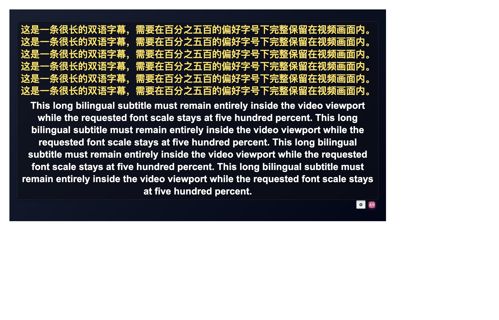

# 阅读可靠性、字幕导出与可复制 PDF

2026-10-10，以 `ce36085f7` 开始，最终已整合 `origin/main` 的 `a95a9f9e0`（Qwen3 信息高亮），保留模型切换与油猴裁剪规则。本轮落实 issue 调研中的两类优先项：阅读过程中失败后能恢复，以及字幕和文档导出的明确体验缺口。未修改版本号或发布商店版本。

## 用户可见变化

| 范围 | 本轮结果 |
| --- | --- |
| 全文失败 | 进度面板保留完成/失败数，可定位失败段落、只重试失败项；成功段落继续保留。重试进入原队列，遵守并发上限和 8 ms 派发时间片。 |
| 复杂网页与恢复 | 补充按钮、行内结构、宿主事件和属性保留、恢复后再次翻译、动态重扫、迟到请求的回归。队列派发前再次检查原失败状态，局部或全量恢复后旧重试不能重新覆盖页面。 |
| iframe / 空闲页面 | frame 状态读取合并在途通知，暂停和销毁即时释放自己的等待；旧回包不能恢复失效会话。可见页上下文检查每秒一次，隐藏页每五秒一次，BFCache 暂停检查，恢复前验证上下文。该计时器次数变化不等同于整页 CPU 节省比例。 |
| 字幕字号 | 80–500%，支持输入整数百分比；长双语字幕按播放器实测尺寸寻找接近最大可容纳字号，最多测量 10 次，保留用户设置值。 |
| 字幕导出 | 开始补译前预览总条目、可用译文、缺失条目、人工轨/缓存命中、去重请求上界及缺失时间跨度。可补齐、只导出已有译文或取消；部分文件明确带 `partial`，保留原时间轴。 |
| 下载取消 | 关闭菜单、换媒体、配置变化、销毁后，旧任务不能记入新媒体或保存文件。首条补译失败立即结束并取消兄弟请求，保留失败反馈。 |
| PDF 导出 | 中文译页使用可见 Unicode 文本，能选择、复制和搜索，长文按固定字号续页；双语原页及图表保留。公式、图形和可选版面预览仍可为图像。 |
| 本地保存说明 | 中英文隐私政策与实际 IndexedDB 行为一致：原文件、解析内容、译文、校订和进度保存在本机；最多 20 份、原文件合计 80 MiB，无按天自动过期，可单份删除或清空，不进入配置云备份。 |

## 独立 review 后修复

- 重扫现有失败目标会丢失恢复回调；现在重绑保留本会话的失败端口。
- 批量失败重试绕过并发队列；现在只登记意图，排队后才恢复和发请求；派发前复验状态、连接和会话。
- 弹窗内可恢复失败被等待态禁用；现在按当前弹窗的实际资格启用动作，正文失败等待弹窗关闭。
- 独立快捷翻译身份的失败污染全文汇总或弹窗工具栏；现在按会话所有权和请求身份筛选。
- 原文字幕下载缺少自有取消等待；现在与译文导出共用任务所有权，保存前再次验证，迟到回包不能 `remember` 或保存。
- 首条补译错误等待其他挂起任务；现在立即返回首错并中止兄弟等待/请求。
- YouTube 同地址更换媒体只改变代际但不关闭旧导出；现在所有平台共享媒体变化取消入口。
- 真实 YouTube 导出取消后按钮未重新启用；现在先解除结束任务的禁用，再重算当前来源资格，旧任务不会解除新任务的 busy 状态。
- 长双语字幕线性收缩会从 500% 直接降至 8 px；现在检查下界后进行有界二分，普通换行模型下接近最大可容纳字号。
- fontkit 的 CFF / transformed WOFF2 子集可产生空字形；最终字体使用经过四字节对齐、无 glyf/loca transformation 的静态 TrueType WOFF2，并覆盖字形轮廓和 Unicode 别名回归。

独立复核未留下已确认且未修复的问题。未提高巨型文件行数上限，也未削减字体字符范围来满足体积门禁。

## 验证与证据

类型检查、架构组和测试归类审计通过。架构组 **33 文件 / 1584 用例**；合并新主分支后的最终目标组 **20 文件 / 803 用例**全部通过，包括 PDFReader 生命周期和高亮模型切换。审计登记数不等于执行全部测试。本轮针对性验证覆盖全文状态/队列、页面和 frame 生命周期、字幕外观与下载，以及 PDF 字体/排版/取消。结构资格测试统一了 `performance.now()` 与 fake timers 的时钟，避免 CPU 负载改变 8 ms 发现时间片；时间片预算另有独立测试。

新增全文 outcomes / outcomeSession / progress、frame 生命周期、失败重试队列、字幕下载与确认/布局、PDF 字体模块的定向 statements / branches / functions / lines 均为 **100%**。既有大型编排模块通过针对性回归，不把定向覆盖误写为全仓库覆盖。

PDF 六文件 **122/122**，独立字体与画布复核 **41/41**。字体模块 coverage 摘要及真实 Unicode、Clipboard、九页续页和两 Canvas 释放证据见 [PDF 验收](./pdf-evidence/README.md)。PDF 浏览器部分使用本地 Vite harness 与隔离 headless Chrome；不把它当作已安装扩展的全部文档流程验收。

实际生产扩展专项使用自有临时 Edge profile、第二屏可见后台窗口和 focus-safe helper，不改变前台应用。网页/provider 响应使用固定夹具，字幕 provider 使用 loopback 服务；不代表在线翻译质量。runner 和截图/JSON 一同保存：

- [网页失败恢复](./browser-evidence/report.json)：失败 1 / 完成 2，只新增一个失败段落请求，成功译文节点保留，恢复与再次翻译通过。
- [复杂网页按钮](./mutation-browser-evidence/report.json)：翻译/恢复/再次翻译 9 / 0 / 9，宿主 DOM、属性与按钮事件保留。
- [字幕生产包](./subtitle-browser-evidence/result.json)：437% 输入刷新后保留，500% 短字幕 105.6 px；长双语字幕 24.39 px，高度 456.06 / 可用 474 px，完整可见。取消不新增请求且按钮可再次操作，partial 保留原时间轴，完整导出只补译两条去重原文，同地址换媒体取消旧预览并清除 busy。



```sh
FLUENTREAD_PLAYWRIGHT_ROOT=/path/to/node_modules node docs/reports/reading-reliability-experience-20261010/browser-check.cjs
node docs/reports/reading-reliability-experience-20261010/subtitle-browser-check.cjs --extension-dir .output/chrome-mv3 --playwright-root /path/to/node_modules --artifacts-dir /path/to/evidence
node scripts/testing/run-translation-mutation-test.cjs --extension-dir .output/chrome-mv3 --playwright-root /path/to/node_modules --focus-safe-helper scripts/testing/focus-safe-browser.cjs --artifacts-dir /path/to/evidence --case button-controls --background --display secondary
```

## 体积与维护成本

同一依赖、独立检出的 `ce36085f7`：Chrome 未压缩产物 **61,637,136 bytes**；油猴 **1,967,852 bytes**。本轮油猴 **1,975,176 bytes**，增加 **7,324 bytes / 0.3722%**，门禁增加 8 KB 到 1,976,000 bytes。

合并最新主分支后的最终产物：Chrome **67,410,793 bytes**，Firefox **67,409,828 bytes**，油猴 **1,975,296 bytes**（比合并前多 120 bytes，仍通过门禁）。Chrome / Firefox 构建、manifest 校验、油猴构建与协议/兼容性/裁剪校验均通过；[体积记录](./validation-evidence/build-sizes.json)保留原始基线和最终数据。

PDF 新字体 **4,977,684 bytes**，SHA256 `ea983e51e010c28a6a03839cffea942243e49342be7307be4f2f283e73ab8127`。保留完整源字符覆盖，拆分共享字形的 497 个 Unicode 别名，防止复制时合并不同字符。字体与约 716.5 KB 的 fontkit chunk 仅在 PDF 文本导出时读取，不进入网页内容脚本或油猴。生产扩展门禁从 65 MB 调整为 **68 MB**，继续按真实磁盘总字节检查；不是忽略或绕过门禁。原生 WASM 的打包方式保持现有规则。

字体源、固定提交、许可证、转换步骤和精确统计见 `public/pdf-fonts/NOTICE.md`、`OFL.txt` 及 `scripts/fonts/build-pdf-reading-font.py`；fontkit 1.1.1 固定在锁文件，保留来源和 MIT 说明。

## 验收边界

未验证 Firefox 实机、真实低配设备、所有网站和在线供应商、50 MB 真文档或商店发布。极小播放器或异常巨长的单条字幕受 8 px 最低字号限制，不能据一般视口测试宣称任意内容都完整可见。PDF 输出和原始字节仍随文档大小占用内存，本轮仅把光栅工作集限制为逐页有界画布。恢复不承诺取消浏览器已经发出的原生消息，但旧结果不再有提交权。
