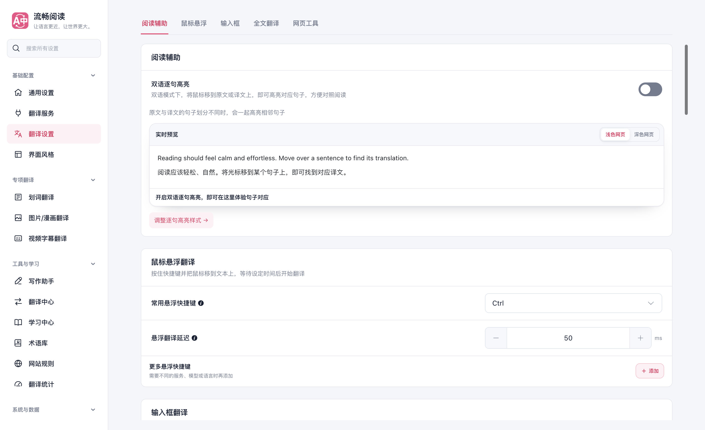
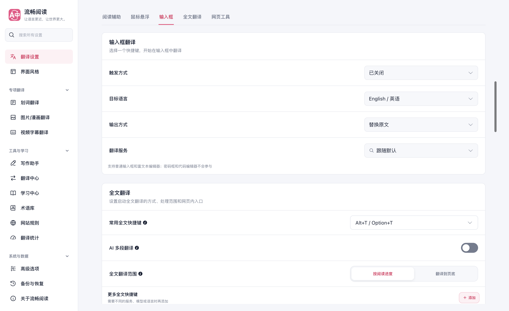
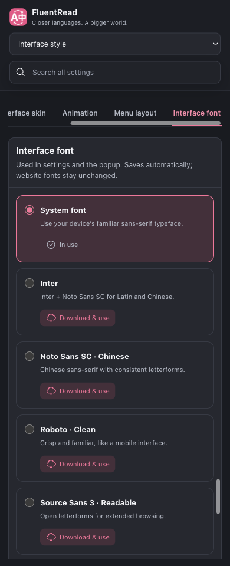

# 设置页同页分区导航验证

工作区：`/Users/thinkstu/Desktop/copy/FluentRead-settings-section-navigation`；任务分支：`codex/settings-section-navigation-20261005`；验证基础：`37357217`（main）。主检出目录保持原样，任务 worktree 保留至 PR 合并或用户取消。

2026-10-05，在 FluentRead 的九个连续设置页加入顶部定位导航。点击模块名称会平滑滚动到模块，折叠模块按需展开，手动滚动同步高亮。窄屏使用一行横向导航，界面语言变化后继续保持当前入口可见。翻译统计和网站规则保留原有视图切换。

实现复用 FluentRead 的 Vue 设置容器、分区标记和本地化资源，没有借鉴或修改参考仓库。搜索定位同时覆盖位于同级 continuation 分区的表单；搜索与顶部导航的延迟定位在后续操作时交接，定位不会写入配置或改变 URL。

| 验证 | 结果 |
| --- | --- |
| 导航、UI 架构、Options 生命周期、userscript 契约 | 4 个文件，70 个测试通过 |
| 其中 userscript 完整设置契约 | 7 个测试通过 |
| 类型检查 | `pnpm compile` 通过 |
| 构建 | Chrome MV3、Firefox MV2 生产构建通过 |
| 测试审计与补丁检查 | `pnpm test:audit`、`git diff --check` 通过 |
| 文档 | `pnpm docs:build` 通过 |
| 生产 UI | 九个设置页，50 次导航定位检查通过；控制台错误 0 |
| 交互 | 点击、Enter 键、平滑滚动、减少动态效果、条件模块、折叠展开、手动滚动、搜索与跨页直达通过 |
| 布局与语言 | 桌面与 1024/820/390 像素检查通过；无文档/内容横向溢出；深色、英文及全部新增英文入口通过 |
| 配置与路由 | 纯导航前后的配置一致，URL 保持当前设置页；统计/网站规则仍只显示选中的视图 |

浏览器使用独立临时 Microsoft Edge profile 和第二块屏幕上的完整可见窗口。报告记录 `launchMode=macos-background-cdp`、`focusPolicy=launchservices-no-foreground`、`windowPlacement.mode=background-visible-no-focus`、`browserFrontmost=false`。本次浏览器和临时 profile 在验证后清理，用户浏览器未被操作。

证据见 [浏览器逐项报告](./browser-report.json)、[导航测试](./navigation-tests.txt)和 [userscript 契约测试](./userscript-options-tests.txt)。导航生命周期夹具同步了现有主题接口、两个媒体监听器和阅读辅助首分区的契约。

本次为定向回归，未运行全量测试；Firefox 完成构建验证，未进行实机 UI 验证；未测试真实翻译供应商或模型下载。
