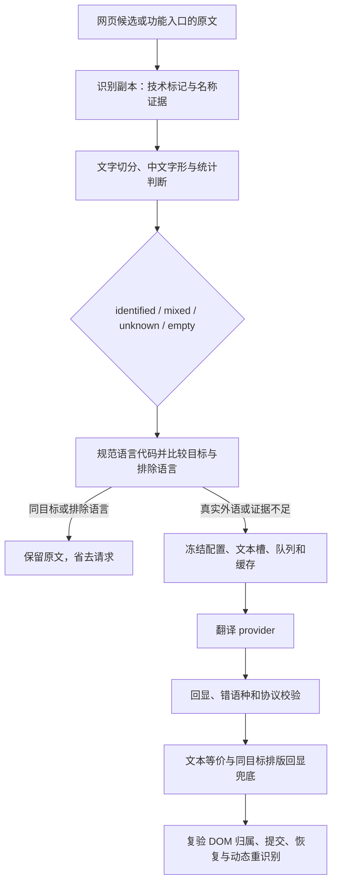

# 目标语言重复翻译：架构审计与改进

本次需求来源于 [GitHub Releases](https://github.com/FluentRead/FluentRead/releases) 的中文发布说明：中文句架内含 `Microsoft Edge`、`Chrome`、`Worker`、`ACP Agent` 等名称，仍被再次翻译。开始工作的基线为 `origin/main` 的 `fe7005dd9`，最终合入 `86a7ab6f2` 后验证；修复在独立分支 `codex/target-language-quality-20261011` 中实现。

## 现有架构



核心判断已经集中在 `src/core/language/identify.ts` 和 `detect.ts`。识别结论与目标语言无关，缓存只以原文为键；`codes.ts` 统一供应商、配置和识别器的代码。`franc-min` 只提供距离排序，再结合文字、功能词与候选分差；排名不是概率，`detectlang` 的最佳猜测不能单独用于跳过。

网页全文与悬浮共用候选运行时；页面标题、逐槽批量请求及 `app/translation/client.ts` 都有预检。划词、翻译中心和文档也经共享客户端；视频在自己的字幕入口执行同一语言判断。源文本或目标变化后会重新判断，不依赖宿主页面的 `lang`。

架构的模块边界合理，问题集中在识别证据和少数入口遗漏，适合在现有链路中改进，而非再建一套语言状态。

## 已确认问题与处理

- 旧名称规则偏向中文，要求严格的双侧汉字或若干特定技术角色。普通发布句架中的产品名称及其他文字里的英文名称被视为外语。新规则按同句本族正文、相邻文字边界和短名称字形识别，限制名称预算，推广到中日韩、Cyrillic、Arabic、Indic 等文字，不维护产品白名单。
- 真正的外语功能词、引述、独立句子和大写英文提示需要优先于名称证据。反引号里的自然语言句子也不能全部当作标识符遮掉；代码、路径和版本信息仍仅在识别副本中处理。
- 行内节点提取原先会人工插入空格，把 `Disney+` 重建为 `Disney +`；普通段落判断正确但拆分 DOM 仍会漏出名称槽。语言预检副本现在保留真实行内邻接，换行、语义块、保护省略和不相邻根节点仍保留分隔。运行时使用这个准确副本，默认请求槽的提取与协议不变；受保护代码的自然正文不能证明旁边可译文字的语言。
- 输入框后台、图片 OCR 文本后台及标准圈选翻译可直接进入 broker，原先缺少同目标预检。本次在普通文本入口补齐。圈选 AI 纠错和视觉转录仍执行各自结构化协议，避免把原文误当 JSON 结果。图片保留 OCR 行索引、重复行和冻结目标；图片与标准圈选的显式词库覆盖均有优先权。OCR 期间关闭词库或删除命中项时，旧版本仍交给原 broker 校验，不能以同目标早退绕过事务；两种变化均以真实 wrapper → handler → broker 回归固定。
- 精确重复译文已有共享规则。本次为网页增加有目标证据的排版等价兜底：原文可信属于当前目标时，只折叠正文中等价的中西文标点、引号外形、陈述句尾句号及汉字/假名间的排版空格；保护引述与代码字面量，包括引用内部空白、零宽字符与 Unicode 序列。带转义引号时保守采用原始比较。字词、数字、否定、大小写、运算符、问号、感叹号、简繁及跨语种变化继续展示。

没有采用通用的 90%/95% 相似度隐藏规则。很长的句子增加一个否定词或修改一个数字，仍可能高度相似；这种规则会把有效变化藏起来。译后兜底不能取代源头过滤，也不会把证据不足的文本静默归入当前目标。

普通多词 TitleCase 名称与外语短标题可能同形。没有明确外语角色保护的文字体系，普通多词项需要内部大写、缩写等独立结构证据；`BlueWave Cloud` 等未知结构名可被接纳，俄、希、希伯来、泰、阿拉伯、印地正文中的普通 `Microsoft Edge` 则保留请求。用正反两组固定这个召回取舍，未添加品牌白名单。

## 参考项目与库选择

参考仓库只进行只读分析，未修改、构建或复制其代码。

| 方案 | 可借鉴之处 | 边界与本次决策 |
| --- | --- | --- |
| [read-frog](https://github.com/mengxi-ream/read-frog/blob/main/src/utils/host/translate/target-language-skip.ts) | 请求前跳过同目标，逐段不调用 LLM | 当前参考快照只检查至少 50 字符、相信 franc 首位，无法解决本次短段落与混合语种问题 |
| [kiss-translator](https://github.com/fishjar/kiss-translator/blob/master/src/apis/index.js) | 多检测器回退，并以翻译服务返回的源语种作第二层判断 | 服务源语言反馈可用于后续增强；其 `isSame` 是源语种等于目标，不是文本相似度；快判不能把全部 Cyrillic 当俄语 |
| [franc](https://github.com/wooorm/franc) | 小型纯 JS、现有跨浏览器与油猴基础 | 官方说明短文本易混淆；保留锁定的 `franc-min` 并改进证据链 |
| [WebExtension detectLanguage](https://developer.chrome.com/docs/extensions/reference/api/i18n#method-detectLanguage) | 无扩展自带模型、可作异步旁证 | 返回语言占比与可靠性，不能把 percentage 当置信度；简繁仍需单独规则 |
| [Chrome LanguageDetector](https://developer.chrome.com/docs/ai/language-detection) | 桌面按需下载原生模型 | 功能检测、用户激活、下载与平台差异；短词仍有准确性限制，不能成为跨浏览器必需项 |
| [fastText lid.176](https://fasttext.cc/docs/en/language-identification.html) | 176 语种；量化 917 kB，完整 126 MB | 还需浏览器推理运行时与简繁判断；模型许可 CC BY-SA 3.0，未在本次语料实测 |
| [Lingua WASM](https://github.com/pemistahl/lingua-rs#11-webassembly-support) | 可限制候选、适合离线研究 | 全语种 WASM 官方约 288 MB，低精度模式对短文损失明显，不作默认扩展热路径 |
| [ELD](https://github.com/nitotm/efficient-language-detector-js#builds) | 纯 JS、60 语种、Apache-2.0，已完成 XS / Small 离线比较 | Small 提高同目标覆盖，但裸 `isReliable()` 首位误跳混合段落与相近语种；不能直接替换统一证据链 |

仓库已有 `language-detection-20260916.md` 与可复现评测脚本：当时完整 franc 未优于统一判断链 + franc-min，直接相信任意检测器第一名会误跳过混合段落。这是历史自编语料证据，不是本次线上准确率。

本次隔离评测 ELD 2.1.0，未安装到项目、未改变 lockfile。XS / Small 的浏览器 min bundle 为 977,990 / 1,633,453 字节，gzip 为 285,363 / 458,416 字节；缺目录里的 `id/ne/si/sw` 四个模型。默认算法只统计文本开头约 350–380 UTF-8 字节，因此长混合正文更不能只按首位跳过。

| 同一 207 条新语料 | 统一证据链 | ELD XS 可靠首位 | ELD Small 可靠首位 |
| --- | ---: | ---: | ---: |
| 52 个自然正文正确跳过 | 45 | 48 | 48 |
| 52 个短标题正确跳过 | 16 | 45 | 45 |
| 49 个技术发布句正确跳过 | 29 | 30 | 43 |
| 207 条对全部目标检查的错误跳过 | 0 | 30 | 32 |
| 40 个组合混合正文错误跳过 | 0 | 40 | 40 |
| 30 个引用/大写外语反例错误跳过 | 0 | 30 | 30 |

这些是自编语料上的决策结果，不是各库一般准确率。混合正文需要检测器外围的保护。ELD 原包 `isReliable()` 的第二候选分数读取还存在可复核实现疑点，评测保留原包行为；完整方法、包散列、预测与本机延迟见 [ELD 评测 JSON](./target-language-quality-20261011/eld-report.json)。

暂不增加“轻量/重型”开关。若后续候选在真实失败样本和独立留出集上带来可重复收益，再以按需下载、Worker、失败回退和能力检测接入增强模式。

复现库对比时，将同一份公开 `eld-2.1.0.tgz` 解包到隔离目录后运行：

```sh
node scripts/testing/run-resource-safe.mjs -- node scripts/testing/benchmark-eld.mjs \
  --eld-dir <解包后的package目录> --eld-tar <eld-2.1.0.tgz> --out <隔离证据目录/report.json>
```

脚本不安装依赖，也不改变项目 lockfile。两次最终执行的语料、包和源码散列、全部决策及浏览器 bundle 字节一致，见 [复现校验](./target-language-quality-20261011/eld-reproducibility.json)。耗时和初始化内存仅为本机 Node 观测。

## 验证与可重复用例

新增发行说明语料覆盖全部 52 个目录目标，含自然段落、短标题、技术混排、代码/链接/版本外壳、Unicode 空白、相近语种和混合负例。每段同时对全部目标及排除语言检查；不以当前目标提示识别器，不要求有歧义的短标题强制归属。

四份自编语料共 579 条，对目录目标共作 29,484 次非空文本决策，统一证据链未错误跳过标注中的外语；空文本另行核对。新的 52 个自然正文跳过 45 个（86.54%），其结构标记外壳保持同一门槛。余下 `id/ms/da/hr/sr/sl/lt` 七段仍是未知，见 [逐段诊断](./target-language-quality-20261011/native-body-diagnostics.json)；这不是 52 种语言均达到完整召回的声明。

验证结果将在本次工作树完成测试后写入同目录的证据报告。生产浏览器使用临时 Edge profile、后台 CDP 和真实快捷键；真实 GitHub 页面与本地结构夹具分别记录。回环翻译端点只证明判断、请求计数和 DOM 状态，不证明供应商翻译质量。

## 持续回归边界

新增 bug 应保留逐字原文、实际目标、识别结果、可翻译外语片段以及 DOM 拆分结构。所有误跳过外语都应进入负例，减少漏判不能通过放宽至“主语言占多数就整段跳过”实现。短标题、共享汉字、相近语言及不确定的小写外语概念允许保留翻译；不能从有限语料通过推出所有网站和语言已零缺陷。
