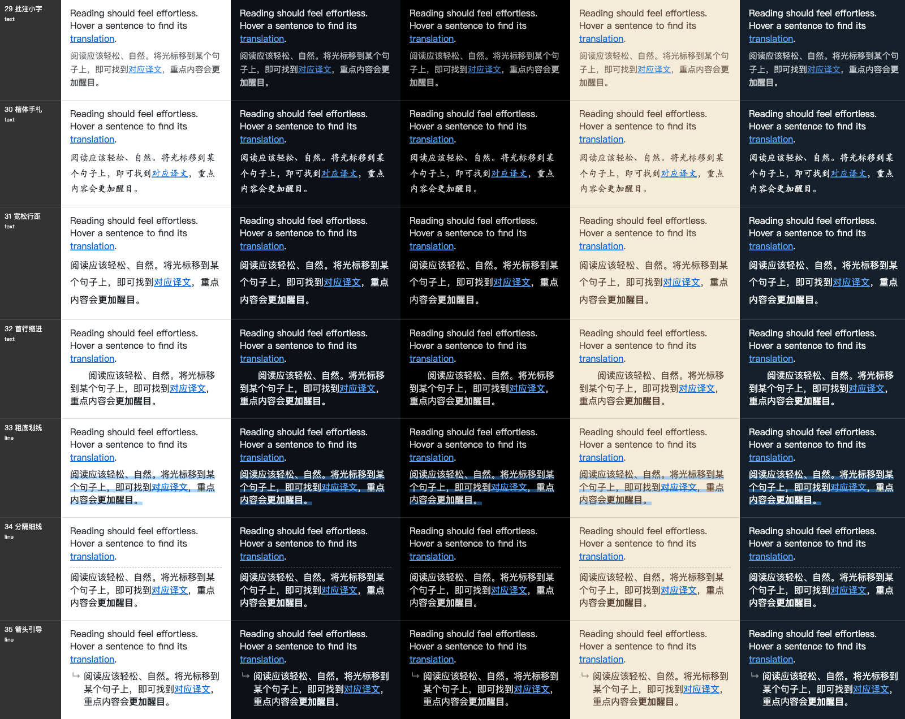
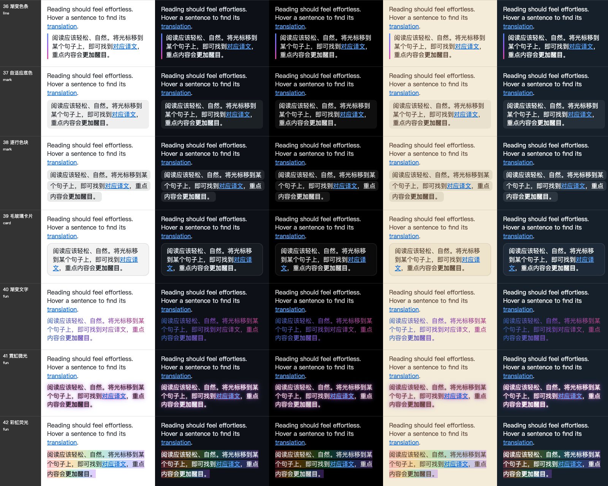
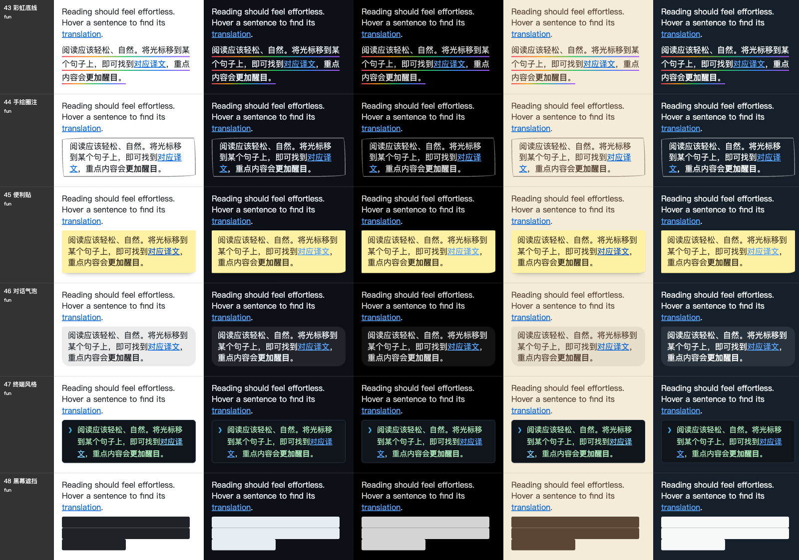

# 译文样式扩充：阅读向与趣味预设

日期：2026-10-10。基线：`f3f6016e8`。目标是丰富“译文样式”，同时保证不同配色的网站和深色网页上都清楚。

## 新增内容

内置预设从 29 个增加到 49 个，编号 29–48，已有编号和含义不变。设置页新增 **趣味** 分类。

| 分类 | 新预设 |
| --- | --- |
| 文字 | 批注小字、楷体手札、宽松行距、首行缩进 |
| 线条 | 粗底划线、分隔细线、箭头引导、渐变色条 |
| 标记 | 自适应底色、逐行色块 |
| 卡片 | 毛玻璃卡片 |
| 趣味 | 渐变文字、霓虹微光、彩虹荧光、彩虹底线、手绘圈注、便利贴、对话气泡、终端风格、黑幕遮挡 |

## 深色网页的处理

译文继承网页的文字颜色。新预设的线条和底色用 `color-mix` 把 `currentColor` 调淡，浅色网页得到浅灰，深色网页得到浅白，不判断网页主题，也不依赖系统深色模式。渐变文字把色标与网页文字颜色混合，浅色网页偏深、深色网页偏亮；浏览器不支持时保持普通文字。便利贴和终端自带表面并同时声明文字颜色。

顺带修正已有问题：渐变卡片、纸张卡片和代码风格在深色网页上会继承网页的浅色链接，链接在白色卡片上看不清，现在统一使用深色链接。

下面三张图把新预设放在五种网页配色上（浅色、GitHub 深色、纯黑、米色阅读站、深蓝论坛），由共享样式表直接渲染：

设置页：[趣味分类](./settings-fun.png) · [深色网页预览](./settings-dark-page.png) · [390px 深色界面](./settings-390-dark-ui.png)

## 验证

- 类型检查、测试分类审计和架构分组（1584 项）通过。
- 单元与功能分组剩余的 27 项失败与同依赖的 `f3f6016e8` 完全相同，均与本次改动无关（图片翻译运行时、实现审计脚本、本地模型下载等）。
- Chrome、Firefox、userscript 构建与 userscript verifier 通过，文档构建通过。
- `scripts/testing/run-translation-style-ui-test.cjs` 在临时 Edge profile 的后台窗口通过：五个分类共 49 张卡片逐个选择、预览与持久化，外观微调、保存样式，浅色与深色网页预览，1024/820/390px 布局，以及本地确定性页面上的实时生效。前台应用前后一致，控制台错误为零。详见[浏览器报告](./report.json)。该脚本原有一处“深色网页”定位同时命中逐句高亮预览，已限定到译文样式分组。
- 五种网页配色的对比图由无头 Edge 直接加载 `translation-display.css` 生成，未经过真实站点；不宣称真实移动设备或 Safari 验证。

## 油猴脚本体积

同依赖下基线 `f3f6016e8` 为 1,975,140 字节，本次为 1,983,325 字节，增加 8,185 字节（0.4144%），来自样式规则、预设注册表和中文名称。预算相应从 1,976,000 提高到 1,985,000。
