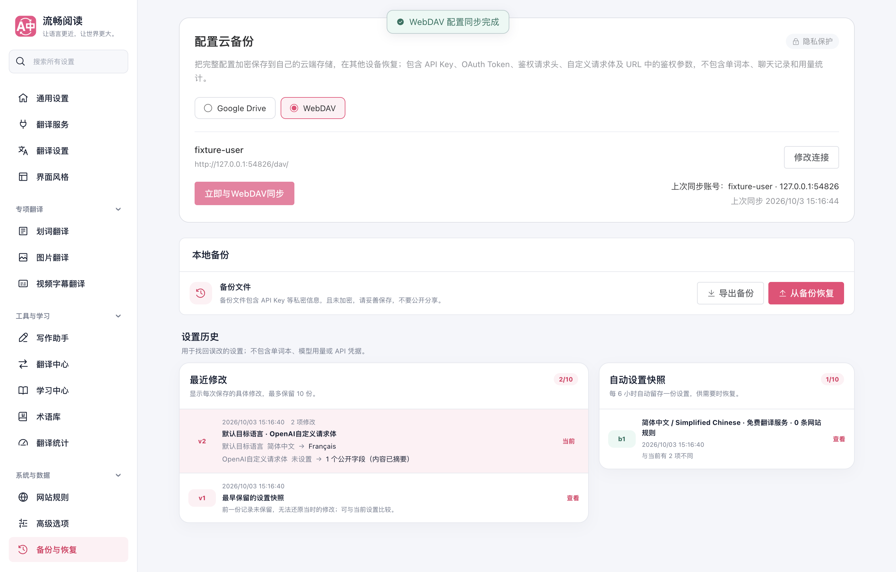
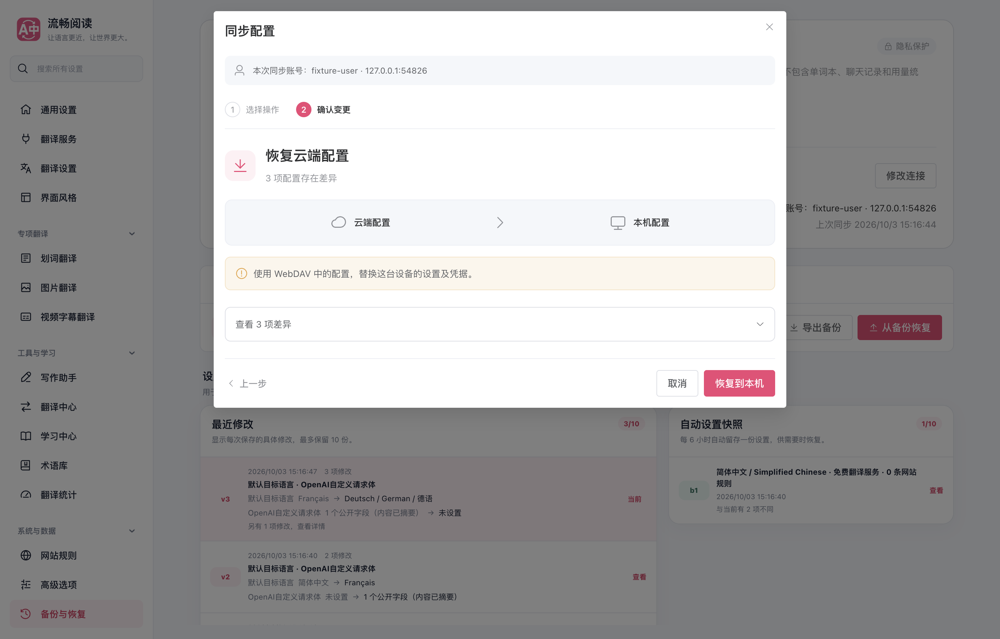
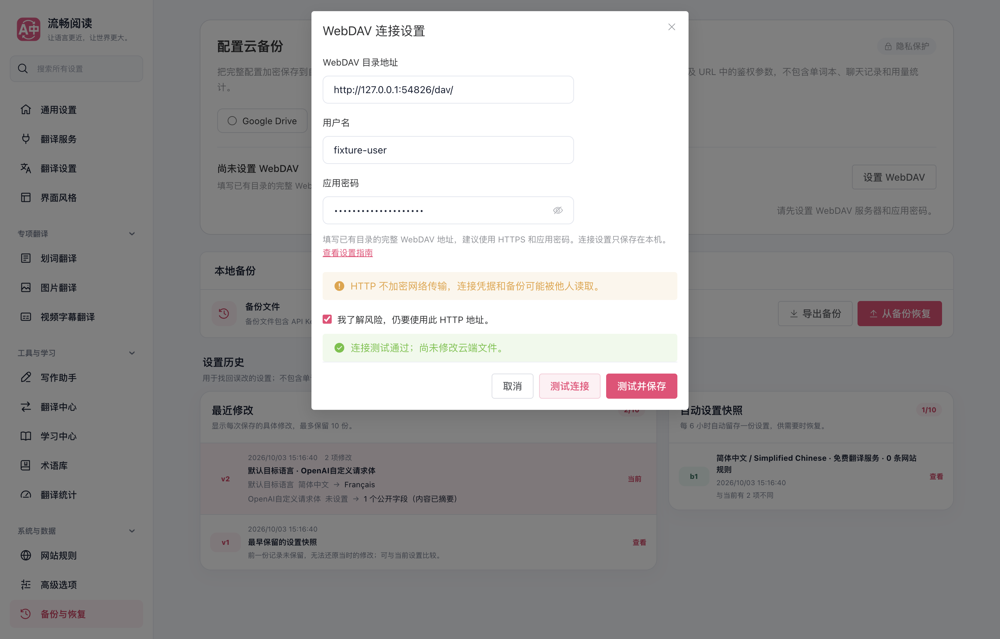
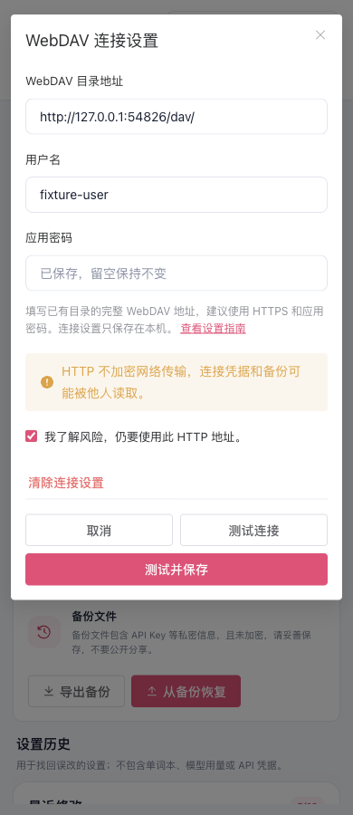
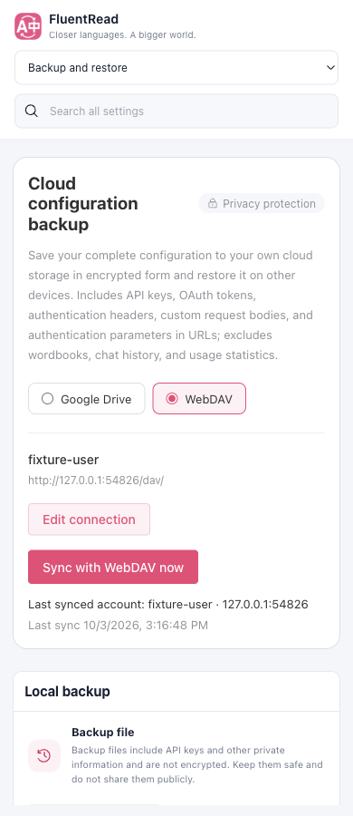

# WebDAV 配置云备份验证

Google Drive 与 WebDAV 归入同一个“配置云备份”入口。两者复用 FluentRead 已有的预览、完整凭据恢复、三方合并和一次性确认事务；WebDAV 单独保存本机连接，使用固定目录和 ETag 条件写入。

实现时以 `06e9efb3` 的最新 main 起步，初次交付集成 main 至 `554711ce`，在 `4af8d01d` 验证；合并前已进一步集成 `f360345b`，最新记录见[合并前复查](./merge-verification/README.md)。没有修改参考仓库，没有跨仓库依赖或新增运行时包。

## 产品与数据边界

- 设置页记住 Google Drive / WebDAV 的选择；账号与上次成功时间右侧展示，窄屏换行。
- WebDAV 测试连接与保存连接都只读目录；确认备份后才创建 `FluentRead/fluentread-config.encrypted.json`。
- 恢复与保存使用两步确认，差异默认收起，逐项合并作为次要入口；取消不写云端。
- 配置备份包含配置中的 API Key、OAuth Token、鉴权请求头、自定义请求体和 URL 鉴权参数；排除学习、聊天和用量记录。WebDAV 连接密码保存在后台专属加密仓库，不回显、不导出，不开放给公共配置读取消息。
- 固定公开应用口令沿用现有决定，不要求用户输入加密口令。文件持有人可解密，因此主要访问保护由账号、目录权限、HTTPS 与设备安全提供。
- 改连接会隔离旧事务和基线；清除连接设置不删除本机配置或服务器文件。油猴脚本显示后台能力限制并保留本地备份。

## 验证结果

| 范围 | 结果 |
| --- | --- |
| `pnpm test:cloud-backup` | 9 个文件、46 个用例通过；11 个云备份可执行模块 statements / branches / functions / lines 全部 100% |
| Google Drive 鉴权、文件、加密、快照与公共存储、i18n 等直接影响范围 | 原定向组 9 个文件、838 个用例通过；语言资源生成后，原失败的 userscript 配置导入验证与资源验证共 11 个用例通过 |
| 集成最新历史与图片翻译改进后的 i18n / 历史 / userscript 定向组 | 4 个文件、85 个用例通过 |
| 生产 MV3 扩展 + 真实本机 HTTP WebDAV 夹具 | 48 项断言通过；保存、完整凭据恢复、条件覆盖拒绝、取消、连接清除、重开无网络、七种语言、390px 布局；无页面控制台异常 |
| `pnpm compile` | 通过 |
| Chrome MV3 / Firefox MV2 生产构建与 manifest verifier | 通过 |
| userscript 构建与 verifier | 通过；不宣称支持扩展后台云备份，保持本地备份入口 |
| `pnpm docs:build`、`pnpm test:audit` | 通过 |
| 源文件头与架构审计 | 源文件头通过；架构仍有 4 项既有失败，见下文 |

核心专项使用真实 Web Crypto。PBKDF2 多次派生的用例在 CPU 限流及并行构建时可能超过默认 5 秒，因此该专项设置 30 秒测试期限；网络请求自身保留 30 秒上限。最后一次专项通过，未跳过测试或降低覆盖率阈值。

架构审计的四个既有问题：文档 UI 的服务层 import、历史大文件的行数上限、品牌检查脚本未归属，以及 share-card / siteRules / excerpt 的既有覆盖率归属。原 main `4e90ea40` 单独运行同样审计也复现了这四项；本次新模块均进入覆盖率清单或明确的后台组装根验证归属。没有为消除既有失败放宽架构规则。

浏览器使用临时 Edge profile，`macos-background-cdp`、`launchservices-no-foreground`、第二屏幕可见窗口，`browserFrontmost: false`。账号、密码与请求正文均为虚构测试数据，测试后已关闭浏览器和本机服务器并删除本次 profile。这里证明生产扩展与真实 HTTP 协议夹具的行为；不等同于已验证真实 Nextcloud、坚果云或 NAS 账号，也不证明商店已发布或 Firefox 真实运行界面已测。

## 界面证据











更多截图与完整断言见 [browser-report.json](./browser-report.json)，核心覆盖率见 [coverage-summary.json](./coverage-summary.json)。

## 复现

```sh
pnpm test:cloud-backup
pnpm test tests/i18n.test.ts tests/configHistoryDomain.test.ts tests/userscriptViteConfig.test.ts tests/userscriptLanguageBundles.test.ts
pnpm compile
pnpm build
pnpm build:firefox
node scripts/testing/verify-extension-manifests.mjs
pnpm build:userscript
node scripts/verify-userscript-build.mjs
pnpm docs:build
pnpm test:audit
```

生产 UI 专项入口是 `scripts/testing/run-webdav-backup-ui-test.cjs`，显式传入 `--extension-dir .output/chrome-mv3`、捆绑依赖的 `--playwright-root`、扩展 UI 技能的 `--focus-safe-helper` 和单独的证据目录。该脚本只启动本机夹具，不要求真实网盘账号。
