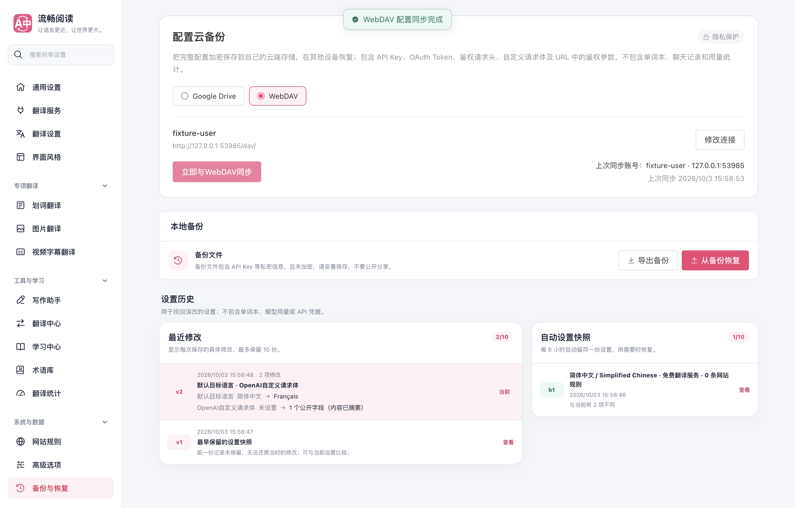
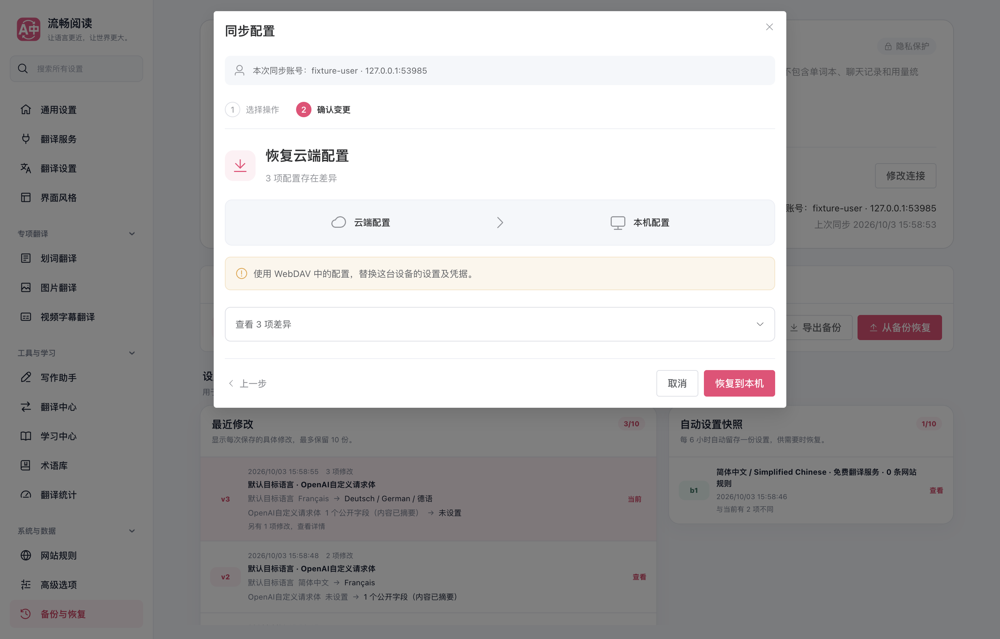

# 合并前复查

已集成 main `f360345b`，保留逐句高亮外观与命名样式配置；最终运行代码为 `2328f191`。WebDAV 的完整备份和第二设备恢复用例明确验证了高亮自定义 CSS、命名样式与当前选中样式。

- 云备份：46 个用例通过，11 个核心模块四项覆盖率均为 100%。
- 配置、差异、Drive 快照、i18n 与资源直接回归：7 个文件、254 个用例通过。
- 静态数据压缩与语言资源：2 个文件、12 个用例通过。完整中文目录分别用 Node gzip 和实际 pako 解压核对，内容一致；油猴产物为 1,869,959 字节，保留原 1,950,000 字节上限。
- 生产扩展 + 真实本机 HTTP WebDAV：48 项断言通过，无页面控制台异常，后台浏览器未抢占前台。
- 类型检查、Chrome / Firefox 构建、manifest verifier、油猴 verifier 和测试归属审计通过。

界面保持原有共用确认流程；构建仅压缩非代码文案数据，不删功能或文案。真实服务兼容性及既有架构审计限制仍按[原验证说明](../README.md)记录。

[全部断言](./browser-report.json) · [核心专项](./cloud-backup-tests.txt) · [无损文案验证](./userscript-tests.txt)
