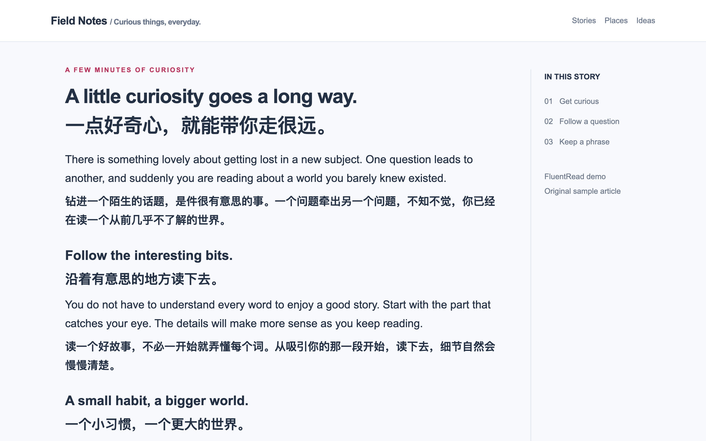

<div align="center">


# FluentRead-流畅阅读

一款开源的双语阅读与翻译浏览器插件。

[安装](#安装) · [官网](https://fluent.thinkstu.com/) · [使用指南](https://fluent.thinkstu.com/guide/) · [English](../README.md) · [GPL-3.0](../LICENSE)

</div>

FluentRead 支持在原网页中对照阅读原文与译文，并提供划词翻译、AI 阅读辅助、图片翻译、文档翻译和视频双语字幕。翻译卡接入了 **DeepSeek Harness 会话内核的浏览器适配**，支持结合上下文解释选中文字并连续追问。

[](../docs/public/screenshots/translation.webp)

## 主要功能

| 功能 | 说明 |
| --- | --- |
| 网页翻译 | 全文双语对照、悬浮翻译与划词翻译，支持恢复原文和网站自动翻译规则。 |
| AI 翻译卡 | 解释含义、分析句子、说明用法与生成练习，支持上下文参考和连续追问。 |
| 学习中心 | 收藏单词、短语和句子，保留原文语境，支持学习与复习。 |
| 图片与圈选翻译 | 识别网页图片或选定区域中的文字，并显示可复制的译文。 |
| 文档翻译 | 支持 PDF、ePub、DOCX 等格式，提供双语阅读、译文校订与文件导出。 |
| 视频字幕 | 支持 YouTube 和 X 双语字幕；部分 X 视频可通过本地模型生成 AI 字幕。 |
| 翻译服务与设置 | 支持免费翻译服务、DeepL、AI 服务和本地 Ollama，可配置术语库、译文样式、快捷键及菜单栏布局。 |

各功能的使用方法与支持范围见[使用指南](https://fluent.thinkstu.com/guide/)。AI 讲解需要配置可用的 AI 服务；第三方服务的费用与可用性由服务商决定。

## DeepSeek Harness

翻译卡采用 DeepSeek Harness 会话内核中会话事件与消息组织部分的浏览器适配，由 FluentRead 连接网页选区、允许参考的段落、模型服务和本地阅读记录。支持选择不同 AI 服务与模型，并提供可选的学习记忆。

该适配用于选区阅读辅助。全文、悬浮和普通划词翻译使用各自的翻译流程。接入范围和上游来源见[内核集成说明](../docs/reports/harness-embedding-map-20260905.md)，MIT 许可见[第三方声明](../public/third-party-notices/deepseek-harness-MIT.txt)。

[翻译卡使用指南](https://fluent.thinkstu.com/guide/deepseek-harness)

## 安装

[Chrome](https://chromewebstore.google.com/detail/djnlaiohfaaifbibleebjggkghlmcpcj) · [Edge](https://microsoftedge.microsoft.com/addons/detail/kakgmllfpjldjhcnkghpplmlbnmcoflp) · [Firefox](https://addons.mozilla.org/zh-CN/firefox/addon/%E6%B5%81%E7%95%85%E9%98%85%E8%AF%BB/) · [油猴脚本](https://greasyfork.org/zh-CN/scripts/482986)

1. 安装扩展并刷新需要翻译的网页。
2. 打开 FluentRead，选择目标语言。源语言默认为自动检测，也可手动指定。
3. 点击“翻译页面”。划词翻译及其他功能可在设置中开启。

各浏览器商店的版本更新可能存在时间差。油猴脚本提供核心网页翻译能力；完整支持范围见[安装指南](https://fluent.thinkstu.com/guide/getting-started)。

## 本地开发

环境要求：Node.js 20 或以上、pnpm 9。

```sh
pnpm install --frozen-lockfile
pnpm dev
```

`pnpm build` 构建 Chrome 扩展，`pnpm compile` 执行类型检查，`pnpm docs:build` 构建官网。架构与测试约定见[架构说明](../docs/architecture.md)和[测试说明](../docs/testing.md)。

## 贡献与反馈

欢迎通过 [Issue](https://github.com/FluentRead/FluentRead/issues) 报告问题或提出建议，并通过 Pull Request 改进代码、文档、界面翻译及[网站适配](../docs/contributing/site-adaptation.md)。

产品介绍与中英文商店图片存放于独立的[宣传与商店素材目录](../marketing/README.md)。

## 支持项目

感谢您对 FluentRead 开发与维护的支持。可以通过微信支付或 Ko-fi 自愿赞赏。

<table>
<tr><th>微信支付</th><th>Ko-fi · 国际支持</th></tr>
<tr>
<td align="center"><a href="./approve.jpg"></a><br />使用微信扫码，点击图片可查看原图。</td>
<td align="center"><a href="https://ko-fi.com/thinkstu"><strong>通过 Ko-fi 支持 thinkstu ↗</strong></a><br /><br />ko-fi.com/thinkstu</td>
</tr>
</table>

## 许可证与隐私

FluentRead 按 [GPL-3.0](../LICENSE) 开源发布，第三方组件的来源与许可见[第三方声明](../public/third-party-notices/)。

云端翻译会将相关文字发送给所选服务。文件解析、图片识别及本地模型功能的数据范围见[数据与隐私](https://fluent.thinkstu.com/guide/privacy)。
